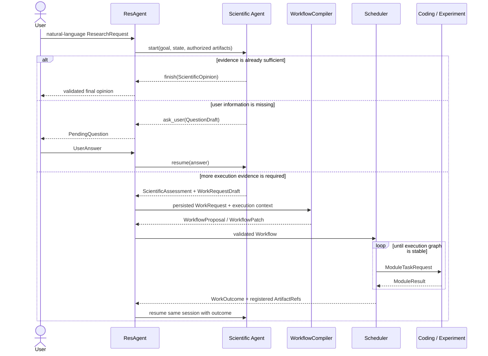
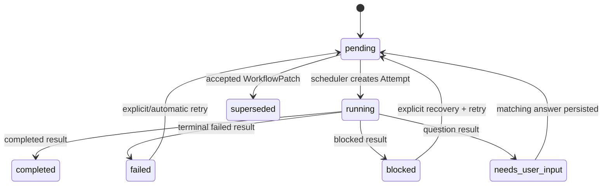
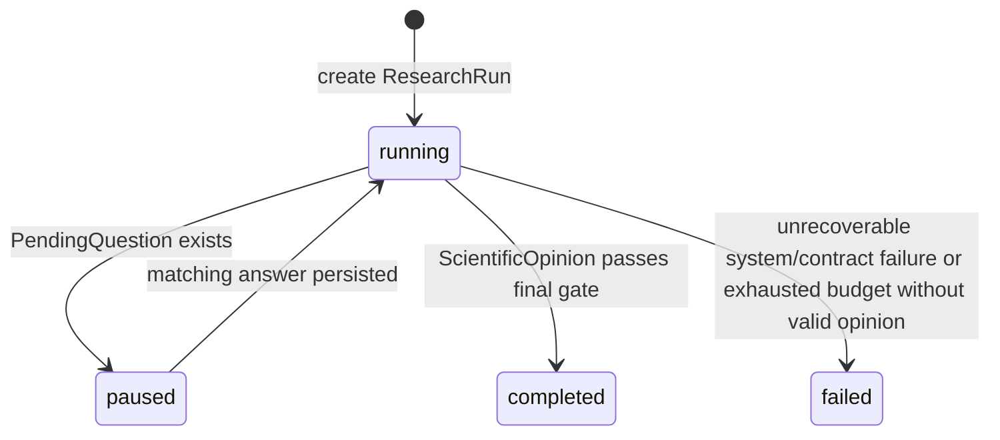

# ResAgent2 系统架构

**文档角色**：系统概念、职责边界、控制流和状态语义的最高级事实来源（semantic source of truth）

**当前基线**：Stabilization 3.0（ADR-0011）已完成，wire schema `3.0`。`ResearchController` 是研究 Run 唯一入口与状态负责人；`WorkflowScheduler` 只执行任务图、不决定 Run 完成；pause/resume 走同一 Attempt；dataset / environment / input artifact / workspace 各有唯一权威来源；公共契约只保留有 production producer+consumer 的字段。

任何改变系统概念、模块职责、控制流或状态语义的变更，必须先修改本文件，再修改契约、开发计划、代码和测试。

## 1. 文档权威关系

| 问题 | 唯一权威来源 |
|---|---|
| 系统概念、模块职责、控制流、状态含义、架构约束 | `ARCHITECTURE.md` |
| 跨模块对象的字段、类型、组合约束和 wire 版本 | `CONTRACTS.md` |
| 开发顺序、阶段范围、完成状态和验收证据 | `DEVELOPMENT_PLAN.md` |
| 已经运行的代码到底做了什么 | 代码和自动化测试 |
| 难以逆转的架构决定及其理由 | `docs/decisions/` |

`README.md` 是派生摘要，不是另一个事实来源。发生冲突时：先由本文件裁定概念，再由 `CONTRACTS.md` 表达数据，由 `DEVELOPMENT_PLAN.md` 安排实现；代码尚未达到目标时必须明确写成缺口，不能把计划描述成现状。

## 2. 一句话架构

**Scientific Agent 是科学大脑，ResAgent 是执行神经系统。**

- Scientific Agent 负责回答：当前证据意味着什么，还缺什么证据，最终能形成什么科学观点；
- ResAgent 负责回答：怎样把“还缺什么”转换成合法任务图，怎样调度、恢复、登记证据和结束 Run；
- Coding Agent 是程序员；Experiment Agent 是实验员；
- Workflow 是 ResAgent 的内部执行表示，不是 Scientific Agent 的公开产物。

最重要的闭环是：

```text
自然语言目标
  → 科学判断
  → 若证据不足，提出语义化工作请求
  → ResAgent 编译并执行任务图
  → 冻结新证据并恢复同一个科学会话
  → 更新科学判断
  → 直到形成最终科学意见或需要用户输入
```

## 3. 目标与非目标

### 3.1 系统目标

1. 用户可以直接用自然语言描述研究目标和约束；
2. Scientific Agent 以一套长期、可恢复的 Agentic Loop 持续形成科学判断，不需要外部选择 plan/analyze 模式；
3. 证据不足时，Scientific Agent 只说明需要什么工作和证据，不承担执行图字段；
4. ResAgent 可以用 LLM 理解工作请求，但必须用确定性代码校验图、状态、预算、安全和 provenance；
5. Coding、Experiment、Scientific 复用同一个 runtime，不复制三套 Agent 框架；
6. 所有跨模块事实通过契约、Run state 和不可变 Artifact 传递；
7. 用户可以解释一次 Run 为什么发起任务、任务产生什么证据、最终观点依据什么。

### 3.2 当前不追求

- 多科学人格辩论、树搜索或 supervisor swarm；
- 给 Scientific Agent 设计 plan/analyze/review 等多套公开模式；
- 让子 Agent 彼此直接调用；
- 让 LLM 直接写 RunStatus、TaskStatus 或历史 Attempt；
- 把聊天记录当作唯一系统状态；
- 分布式调度、并行 worker、插件市场或通用聊天产品；
- 为可能出现的需求提前建设复杂抽象。

## 4. 核心概念与所有权

| 概念 | 准确含义 | 所有者 |
|---|---|---|
| ResearchRequest | 用户确认的自然语言目标、上下文、约束和总预算 | ResAgent |
| ResearchRun | 一次研究从目标到最终意见的完整持久化状态 | ResAgent |
| ScientificSession | Scientific Agent 对同一 ResearchRun 的长期可恢复推理状态 | Scientific Agent/runtime；ResAgent 只持有引用 |
| ScientificAssessment | Scientific Agent 在某一时点对目标、证据、局限和未解问题的当前观点 | Scientific Agent |
| WorkRequestDraft | Scientific Agent 对“还需要得到什么证据”的语义请求，不含执行字段 | Scientific Agent |
| WorkRequest | ResAgent 分配 ID 并持久化后的工作请求 | ResAgent |
| WorkflowCompiler | 把 WorkRequest 翻译为 WorkflowProposal/Patch 的无状态有界组件 | ResAgent |
| WorkflowProposal | 尚未被接受的初始执行图候选 | WorkflowCompiler 产生，ResAgent 校验 |
| WorkflowPatch | 对已接受执行图的受限修订候选 | WorkflowCompiler 产生，ResAgent 校验 |
| Workflow | ResAgent 接受并持久化的有版本任务图 | ResAgent |
| WorkflowTask | 调度器调用一次专业执行能力的顶层工作单元 | ResAgent |
| Attempt | 某个 WorkflowTask 的一次真实模块调用边界 | ResAgent |
| WorkspaceSpec | 一个逻辑工作区的来源声明（source_kind + location），不保存物理路径 | ResAgent 的 composition root 声明 |
| WorkspaceRecord | 一个工作区解析后的记录（root、source、managed、initial_commit） | ResAgent |
| WorkspaceGrant | 某次 Attempt 的最大物理授权边界，由 WorkspaceRecord 派生 | ResAgent |
| WorkOutcome | 一次 WorkRequest 执行稳定后，成功、失败、警告和 Artifact 的汇总 | ResAgent |
| ScientificOpinion | Scientific Agent 对用户目标给出的最终自然语言观点及证据引用 | Scientific Agent |
| ScientificCompletionValidator | 验证科学闭环结构、证据 provenance 和控制状态；不判断科学观点真假 | ResAgent |
| ArtifactCandidate | 模块声明的待登记文件 | 生产它的模块 |
| ArtifactRef | ResAgent 验证、冻结并登记后的不可变证据引用 | ResAgent |
| PendingQuestion | 已持久化、会暂停 Run 的用户问题 | ResAgent |

`ScientificAssessment` 与 `ScientificOpinion` 的正文是自然语言；小型结构化外壳只服务于控制、证据引用和验证，不把科学推理固定成枚举流程。

必须始终区分执行身份：

```text
WorkRequest（为什么需要执行）
  └─ Workflow revision（ResAgent 怎样安排执行）
       └─ WorkflowTask（一个顶层工作单元）
            └─ Attempt（一次模块调用）
                 └─ Session（模块内部 Agentic Loop）
                      └─ AgentAction（单步 Tool 动作）
```

ScientificSession 不属于某个 WorkflowTask；它属于整个 ResearchRun，可以跨越多个 WorkRequest 和 Workflow revision。Coding/Experiment Session 仍属于具体 Attempt。

## 5. Phase 7 目标架构


图中的 LLM 职责只有两处：Scientific Agent 做开放科学推理；WorkflowCompiler 做有界的语义到执行图翻译。Validator、Scheduler、Artifact Registry、状态转换和 gate 都由代码控制。

## 6. 两种循环和一个编译步骤

### 6.1 科学控制循环

它跨越整个 ResearchRun：

```text
加载或创建 ScientificSession
  → 注入目标、当前 Run 摘要、授权 Artifact、上次 WorkOutcome/用户回答
  → Agentic Loop 自主读取 Artifact、检索文献和推理
  → request_work：保存当前 ScientificAssessment 和 WorkRequestDraft
     或 ask_user：保存问题并暂停
     或 finish：提交 ScientificOpinion 候选
  → 有新证据/回答后恢复同一 Session
```

Scientific Agent 没有显式 plan/analyze 模式。`request_work`、`ask_user` 和 `finish` 是控制信号，不是三种 Agent 实现。

每次 `request_work` 必须同时给出当前科学观点，禁止只派工作、不说明科学理由。它对 Scientific Agent 类似一个异步 Tool：调用后暂停，ResAgent 完成工作后把 `WorkOutcome` 作为 observation 返回。

runtime SessionStore 持有完整 Tool event history。ScientificPort 的确定性 finalizer 只从成功的 `read_artifact` / `literature_search` Tool observation 中提取 `observed_artifact_ids`，LLM 不能直接填写这组 trace；ResearchController 在 Registry 复核后把并集持久化进 ResearchRun，不读取或复制 Session 私有内容。

### 6.2 Workflow 执行循环

它由 ResAgent 的确定性代码驱动：

```text
读取已接受 Workflow
  → 稳定计算 ready Task
  → 创建并保存 running Attempt
  → 通过 capability 对应的 ModulePort 发出 ModuleTaskRequest
  → 接收并校验 ModuleResult
  → 登记 Artifact、结束 Attempt、更新 Task
  → 处理 retry / blocked / question / patch
  → 图稳定后生成 WorkOutcome
```

Scheduler 不选择 Agent 内部 Tool；Agentic Loop 不修改顶层 TaskStatus。

### 6.3 WorkflowCompiler

WorkflowCompiler 不是第三种循环。它把一次 `WorkRequest` 翻译成一张可执行图，采用“语义草图 + 确定性物化 + 一次语义审查”（ADR-0010）：

```text
WorkRequest + 能力注册表 + 当前 Workflow 摘要 + Run 约束
  → (LLM 只输出) CompilationDraft —— summary/rationale + 局部 task key + 局部依赖 + capability + inputs
  → (确定性 _materialize_draft) 结构校验 + 分配全局 TaskId、绑定 work_request_id、解析 workspace、转换局部依赖
  → (LLM 一次短审查) CompilationReview —— accepted / missing_requirements
  → WorkflowProposal（尚无图）或只追加的 WorkflowPatch（已有图）
```

LLM 只负责语义：做什么、任务之间有什么关系。所有运行时身份、作用域和状态由代码决定——LLM 不输出全局 TaskId、WorkRequestId、revision、status 或旧 Task 引用，也不输出代码细节（文件路径、函数位置、CLI 参数、验证命令）；`code_modify` 的 `suggested_paths` 在物化时被强制清空，Coding Agent 自己探索工作区决定“在哪里、怎么做”。允许它使用结构化 LLM 调用，因为自然语言证据需求到具体 capability 的映射需要语义理解；但它必须无长期 Session、不调用专业 Agent、不形成科学结论、不改持久化状态，并把结果交给确定性 validator。它只选择任务类型、目标、依赖和逻辑 `workspace_id`；不扫描源码、不指定文件、不生成验证命令、不决定物理目录、不执行 `git clone`。

结构校验通过后，Compiler 再做一次短小的**语义完整性审查**（`CompilationReview`）：判断草图有没有漏掉请求明确要求的前置任务（如“先实现再做实验”却只生成 experiment_run）。结构拒绝与语义不完整各自最多带精确反馈重编一次，第二次仍失败才把 WorkRequest/Run 置为 failed。现有 `_reject_*` 校验作为最终防御继续在物化结果上执行，Scheduler 保留同等检查。测试中可由 `DeterministicWorkflowCompiler` 替代。

下游任务的约束只来自 `WorkflowTask.constraints`——由 Compiler 从最新 WorkRequest 分配给每个 Task；Scheduler 只传 `task.constraints`，不再把 `ResearchRequest.constraints` 原样广播给每个子 Agent。这样 Scientific 已经消化的旧控制约束（如「先问用户」）不会再污染 Coding/Experiment 的上下文。

LLM 调用可开启一个最小 JSONL trace（`OpenAICompatibleClient.trace_dir` + `trace_level`，off/metadata/full）：记录 run/session/task/agent/step、model、latency、retry、usage、call_id/created_at；full 档才保留完整 request/response，metadata 档只记 hash/tool/valid。目录 0700、文件 0600，永不记录 API key，trace 不进 ArtifactRegistry 也不进 Run JSON，仅用于调试。

## 7. 完整工作流

### 7.1 新 Run



### 7.2 工作失败与修复

Task failure 是执行事实，不等于科学 Run 立即失败：

```text
Experiment Task failed/blocked
  → Scheduler 先按 retry policy 处理
  → 图稳定后 WorkOutcome 记录失败、警告、诊断 Artifact
  → Scientific Agent 根据失败原因更新判断
  → 可 request_work 请求代码修复、替代实验或更多诊断
  → ResAgent 编译为 WorkflowPatch 后继续
```

### 7.3 用户问题

Scientific、Coding 或 Experiment 都只能产生 `QuestionDraft`。ResAgent 分配 QuestionId，持久化 PendingQuestion 并把 Run 置为 paused。回答必须匹配 run/task/session；恢复时复用对应 Session，普通 retry 不复用 Session。

## 8. 模块职责

### 8.1 ResAgent / Research Orchestrator

负责自然语言入口、ResearchRun/ScientificSession 引用、WorkRequest 生命周期、WorkflowCompiler、Proposal/Patch 校验、Task/Attempt 调度、retry、问题协调、Artifact、预算、WorkOutcome 和 ScientificCompletionValidator。它还管理 Run 中的逻辑工作区（`ResearchRun.workspaces`），把 `workspace_id` 解析为物理 `WorkspaceRecord` 并为每个 Attempt 派生 `WorkspaceGrant`，同时用 `RunLayout`/`ResourceLayout` 分开 Run 数据目录与共享资源目录。

它不形成科学观点，不修改代码或运行实验，不读取/篡改子 Agent 内部 Session，也不让 LLM 直接决定状态转换。

### 8.2 Scientific Agent

唯一职责是科学判断。输入是目标、当前 Run 摘要、授权证据、WorkOutcome 和用户回答；对外动作只有 `request_work`、`ask_user` 和 `finish`。证据引用校验在 `request_work`/`ask_user` 工具内进行：引用未观察到的 artifact 返回 `ok=False` 的可恢复反馈（而非 loop 后硬失败），让 Agent 改正后再走闭环。

它可以直接使用只读 `read_artifact` 和 `literature_search` Tool。它不输出 WorkflowProposal/Patch，不选择 capability、workspace、环境或执行器，不修改 Task/Run 状态，也不直接调用 Coding/Experiment Agent。

### 8.3 Coding Agent

负责准备或复用代码仓库、自己读项目结构（含 Python 与依赖要求）、在授权范围内修改代码、按需用共享环境工具（`prepare_environment`/`run_setup`/`audit_env`）准备并绑定环境、根据项目实际选择验证命令并在**绑定环境**中执行验证、按错误修复，最后交付 patch/变更文件/验证结果。它不作科学结论，不直接调用其他 Agent，不扩大 workspace 授权。

### 8.4 Experiment Agent

负责在指定逻辑工作区运行实验（复用 Coding 已改过的代码）、通过共享环境工具（`prepare_environment`/`run_setup`/`audit_env`）准备环境、解析数据集引用、登记指标/日志和实验结果。它通过同一个 `workspace_id` 操作与 Coding 相同的 `WorkspaceRecord`，仓库来源来自统一工作区上下文而非 `ExperimentRunInput`。它不作最终科学结论，不直接调用 Coding Agent，也不自行创建 repair Task。

### 8.5 runtime 与 capabilities

`runtime` 只回答“Agent 怎样运行”：Agentic Loop、LLM client、Context Composer、Tool 协议/分发、PermissionPolicy、Session/event 持久化和统一错误映射。Loop 用 `ToolObservation.ok` 区分成功与可恢复失败，把拒绝落为持久 `runtime_feedback`（`ok=False`、最高优先级 required 注入），维护有界 `recent_observations`（head+tail 截断，保留末尾错误字段），并对连续失败计数（成功的非 finish 工具重置、completion check 拒绝的 finish 累加；连续 5 次返回 `TOOL_FAILED`）。

`capabilities` 只回答“Agent 可以调用什么能力”：workspace、process、Artifact 读取、Git、repo materialization、environment（`EnvironmentManager` + `prepare_environment`/`run_setup`/`audit_env` 三个共享 Tool）、dataset、hardware，以及 Phase 7 的 literature。它提供 `ResourceLayout`（共享 dataset/env 缓存的路径约定）；`RunLayout`（Run 数据目录约定）归 orchestrator。它们提供物理边界和可审计执行，不包含科学决策或 Workflow 调度。

代码依赖为两支：`contracts ← runtime ← capabilities ← agents`，以及 `contracts ← orchestrator`。composition root 同时依赖 orchestrator 与具体 Agent，并通过 Port 注入。orchestrator 不 import 具体 Agent；runtime 不依赖 capabilities；capabilities 不依赖具体 Agent。

## 9. 已实现的执行边界（Phase 5/6）

### 9.1 Coding

原生 Coding Agent 的 `code_understand` 与 `code_modify` 复用同一 AgentLoop，并在 loop 前确定性复用 `RepoMaterializer` 准备/复用仓库。`code_understand` 不注入写/进程 Tool并在结束时验证 Git 未改变；`code_modify` 的写入受 WorkspaceGrant 限制，Agent 先读项目的 Python/依赖要求、按需用共享环境工具（`prepare_environment`/`run_setup`/`audit_env`）准备并绑定环境，验证命令由 Agent 根据项目实际自行选择（shell-free，经 ProcessRunner 的结构化解析与权限检查，在绑定环境执行）。finalizer 以真实 Git diff 和命令结果生成 payload/ArtifactCandidate。

工作区允许共享且可含未提交改动：Attempt provenance 由 `GitBaseline`（临时 index + read-tree + add -u + write-tree）按 Attempt 隔离变更建立，不要求干净工作区。ProcessRunner 不是 OS 沙箱；可信调用方若提供过弱验证命令，系统不能证明代码真正满足自然语言目标。这些限制不会因 Phase 7 改变。

### 9.2 Experiment

原生 Experiment Agent 实现 `experiment_run`：在统一工作区上由 RepoMaterializer 确认 source+commit，EnvironmentManager 用 `run_id + workspace_id` 绑定基础环境（`inspect`/`prepare`/`audit`，env 目录来自 `ResourceLayout.env_root`），依赖安装由共享 `run_setup` 完成，HardwareAudit 提供硬件上下文；任务级数据集经 `DatasetRef(dataset_id, relative_path)` 解析到 `ResourceLayout.dataset_root` 下的具体只读目录（两层模型：`dataset_root` 是公共根、`DatasetRef` 指向具体数据集），并经通用环境变量 `RESAGENT2_DATASET_ROOT`/`RESAGENT2_DATASETS_JSON`（id→路径映射）交给脚本，不绑定框架也不假定「第一个数据集」；实验命令需先通过绑定当前环境的 audit。finalizer 要求至少一次实验命令成功，且 Artifact 必须相对本 Attempt 基线新增或改变。实验输出写入 Attempt 目录或 ArtifactRegistry，不写入共享缓存。

ProcessRunner 同样不是 OS 沙箱；environment audit 是流程正确性检查而非安全隔离；setup/experiment 分类也不是安全分类。详细约束见 ADR-0004、ADR-0005 和 contracts。

## 10. 模块通信规则

专业 Agent 不能直接互调。Phase 7 目标边界只有：

- ResAgent → Scientific：`ScientificTurnRequest`；
- Scientific → ResAgent：`ScientificTurnResult`；
- ResAgent 内部：`WorkRequest` → WorkflowCompiler → `WorkflowProposal | WorkflowPatch`；
- Scheduler ↔ Coding/Experiment：`ModuleTaskRequest` → `ModuleResult`；
- ResAgent → Scientific：`WorkOutcome` + 已授权 `ArtifactRef`；
- Agent → ResAgent：`QuestionDraft`；ResAgent ↔ User：`PendingQuestion` / `UserAnswer`。

命名固定为：`Research Orchestrator / ResAgent` 是顶层模块，`ResearchController` 是该模块内驱动研究闭环的实现组件，`ScientificPort` 是 ResearchController 调用 Scientific Agent 的唯一边界。不得再使用 `ScientificControlPort` 指代另一套组件。

`WorkflowProposal` / `WorkflowPatch` 仍是 typed boundary，但不再跨 Scientific Agent 边界。`scientific_plan`、`scientific_analyze` 和 `literature_search` 的旧 task capability 是迁移对象，不是 Phase 7 目标生产接口。

## 11. 状态与生命周期

### 11.1 TaskStatus



### 11.2 ResearchRun

`planning`、`analyzing`、`replanning` 都是活动，不是 RunStatus：



WorkRequest 执行期间 Run 仍为 running；无需增加 planning 或 waiting_for_work 状态。单个 required Task 失败先进入 WorkOutcome，而不是直接把 Run 置为 failed。

### 11.3 当前实现与目标差异

Phase 7.7 原子切换后，production composition root 走 `ResearchController`：`ScientificAgent` 提出 `WorkRequestDraft`，`WorkflowCompiler` 生成 WorkflowProposal/Patch，`WorkflowScheduler` 执行 Coding/Experiment 图，`WorkOutcome` 回传 Scientific Session 再形成最终 `ScientificOpinion`，经 `ScientificCompletionValidator` 后写 completed。旧的 PlanningPort 与 `LegacyScientificAnalyzeAdapter` 已删除。Stabilization 3.0（ADR-0011）起，`WorkflowScheduler` 只执行任务图、不再决定 ResearchRun 完成；`ResearchController` 是唯一的 Run 创建/回答/完成入口，任务级 ask/resume 在同一 Attempt 上继续。

## 12. Artifact 与安全边界

Artifact 保持两道检查：

1. capabilities/Tool 执行前按 WorkspaceGrant 做 resolve、symlink 和读写授权检查；
2. ResAgent 登记时重新检查文件存在、相对路径、containment、symlink escape，计算 hash，绑定 run/task/attempt 并冻结复制。

只有 completed/completed-with-warnings Attempt 的 Artifact 自动作为成功证据传播；失败/blocked Attempt 的诊断 Artifact 可以登记并进入 WorkOutcome，但必须保留失败语义。

Scientific Agent 只能通过 ArtifactRef allowlist 读取已有证据。它输出的 evidence_artifact_ids 必须来自本 Run 且确实通过 `read_artifact` 或 `literature_search` Tool 观察过。

schema 1.1 的 ArtifactRef 只能绑定 Task/Attempt；Phase 7 schema 2.0 增加 Scientific Session provenance。`literature_search` 成功后先规范化结果，通过 composition root 注入的 Artifact registration port 交给同一个 ResAgent Artifact Registry，以当前 run/session 冻结登记，再把 ArtifactRef 返回 Agent。Scientific Tool 不能自行分配 ArtifactId、hash 或伪造 provenance。

observation history 的所有者是 runtime SessionStore；ResAgent 不读取原始 prompt、reasoning 或任意 Session event。跨边界只传 ScientificPort finalizer 从 trusted Tool result 派生的 `observed_artifact_ids`，ResearchRun 持久化其已复核并集用于最终审计。

## 13. 完成判定

### 13.1 Phase 6 当前 production gate

当前 production 路径仍只检查：无 PendingQuestion、无 ready/running Task、所有 required 非-superseded Task completed。schema 1.1 的 `SuccessCriterion` / `evidence_key` 历史上从未求值，现已从 schema 2.0 代码删除；Artifact 路径、hash 和 provenance 继续在登记时验证。

### 13.2 Phase 7 scientific gate（7.6 代码已实现，7.7 切 production）

schema 2.0 删除通用 `SuccessCriterion` / `evidence_key`，不实现中心求值器。Coding、Experiment、Scientific 各自的确定性 finalizer 是领域完成证据的唯一判断者；ResAgent 不从 summary 或任意 payload 猜测完成状态。

ResearchRun 只有同时满足以下条件才能 completed：

1. Scientific Agent 已通过 `finish` 返回合法 ScientificOpinion；
2. 没有 active WorkRequest、running Task 或 PendingQuestion；
3. opinion 引用的 ArtifactId 都属于本 Run、已登记，且包含在 ScientificTurnResult 的 code-derived observed_artifact_ids 和 ResearchRun 已复核 trace 中；
4. opinion 明确写出观点、证据、局限和未解决问题；
5. final report 只展示 ResearchRequest、Run state、registered Artifact 和 ScientificOpinion 中可追踪事实；
6. 每个执行 Task 的领域完成证据已经由所属 capability finalizer 验证，不能由 summary 冒充；
7. 所有仍 failed/blocked 的 TaskId 都出现在 opinion.acknowledged_task_ids，且 limitations 非空，不能静默丢失。

`inconclusive` 是合法科学观点，不等于运行失败。若系统忠实完成了可执行工作、证据可追踪且 opinion 说明为何不能下结论，Run 可以 completed。运行失败表示系统没有形成可靠闭环，例如预算耗尽且无合法 opinion、状态损坏或不可恢复契约错误。

这里的“验证”是闭环一致性验证，不是科学真理验证。Scientific Agent 的 deterministic completion check 使用同一不可变 Run snapshot 在 Session 完成前检查候选；ResAgent 的 ScientificCompletionValidator 再独立复核。若两者不一致，按 `contract_error` 处理，不能把无效候选写成 completed。观点是否在语义上正确属于模型质量与评测，不属于确定性状态机能够证明的事项。

## 14. 当前实现、目标和迁移原则

| 项目 | Phase 6 当前实现 | Phase 7 目标 |
|---|---|---|
| 入口 | `create_run(request, proposal)` | `create_run(request)`，自然语言目标进入科学控制循环 |
| Scientific | legacy planning/analyze adapter | 一个长期 Scientific Agentic Loop |
| 图产生者 | PlanningPort/Scientific 语义 | ResAgent 内部 WorkflowCompiler |
| 文献检索 | task capability 占位 | Scientific 直接使用 capabilities Tool |
| 科学会话 | 绑定 task Attempt | 绑定 ResearchRun，跨多个工作周期恢复 |
| task failure | 可能直接导致 Run failed | 先形成 WorkOutcome，再由 Scientific 决定下一步 |
| 完成条件 | task graph gate | ScientificOpinion + evidence + no active work gate |
| wire schema | 1.1 | Phase 7 按 CONTRACTS 演进 |

迁移必须遵守：新接口先有 contract tests；新旧路径只可在未发布开发分支短暂共存；production composition root 始终只启用一条；7.7 原子切换已删除 PlanningPort、`LegacyScientificAnalyzeAdapter` 和旧 scientific task capability；schema 2.0 中间状态不得发布；目标声明通过测试后才能写成已实现。

## 15. 不可破坏的架构约束

1. Scientific Agent 不输出执行图字段；WorkflowCompiler 不形成科学结论、不决定代码文件/验证命令/物理目录；
2. ResAgent 可以使用 LLM 编译图，但状态转换只由代码执行；
3. 专业 Agent 不直接互调；
4. WorkflowTask、Attempt、Session、AgentAction 不得混为同一层；
5. 跨模块持久事实必须成为 contract 字段或 Artifact，不能只藏在 prompt/summary；
6. runtime 不包含领域 Tool，capabilities 不包含 Agent 策略，Agent 不包含顶层调度器；
7. 失败、警告和不确定性必须保留，不能通过自然语言包装成成功；
8. 每次扩展先证明简单方案不足，禁止为未来假设过度设计。
