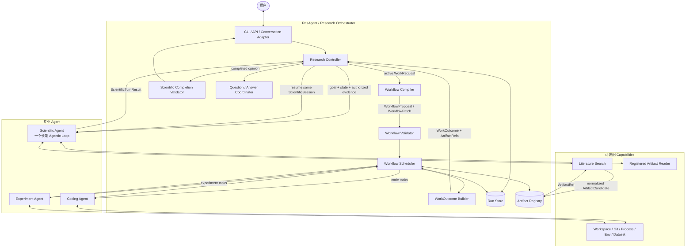
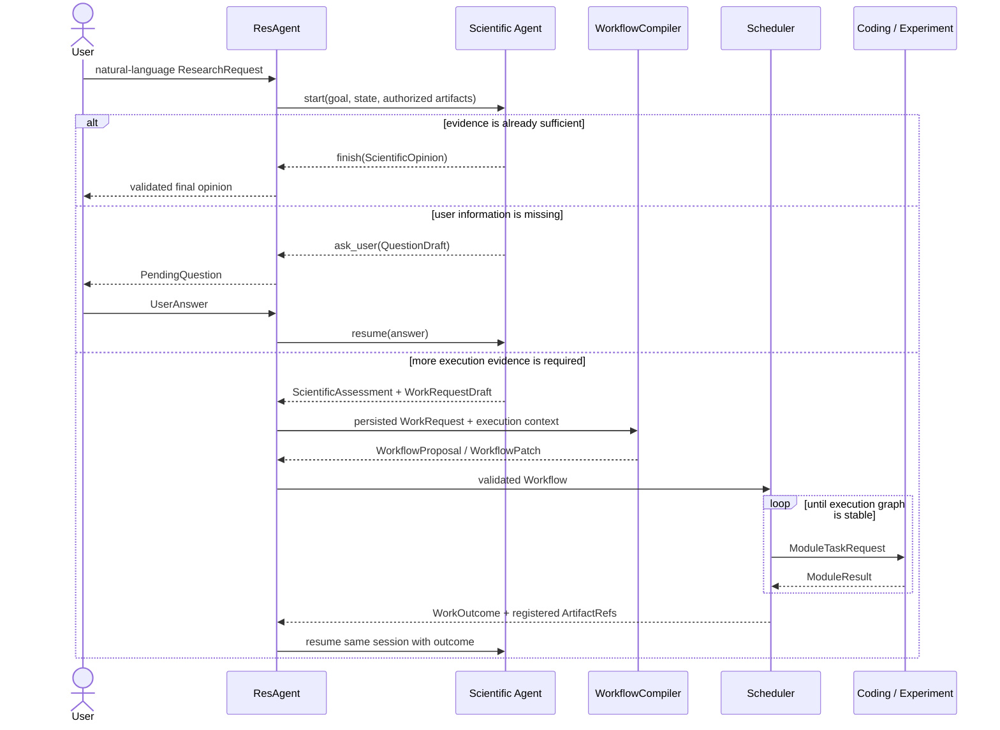
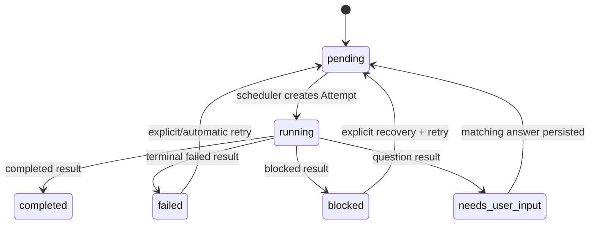
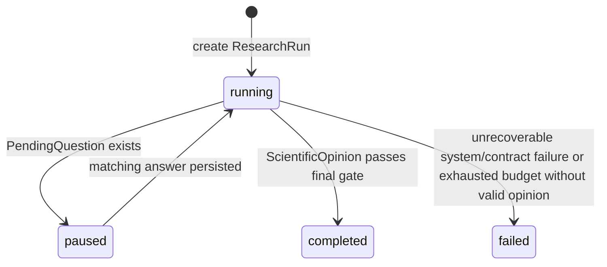

# ResAgent2 系统架构

**文档角色**：系统概念、职责边界、控制流和状态语义的最高级事实来源（semantic source of truth）。

**当前基线**：Stabilization 3.0（ADR-0011）之后的 wire schema `4.0`（输入与证据闭环收敛）。`ResearchController` 是研究 Run 唯一入口与状态负责人；`WorkflowScheduler` 只执行任务图、不决定 Run 完成；pause/resume 走同一 Attempt；dataset / environment / input artifact / workspace 各有唯一权威来源；公共契约只保留有 production producer+consumer 的字段。schema 4.0 是 clean break，旧 3.0 state 不恢复。

任何改变系统概念、模块职责、控制流或状态语义的变更，必须先修改本文件，再修改契约、开发计划、代码和测试。

## 1. 文档权威关系

| 问题 | 唯一权威来源 |
|---|---|
| 系统概念、模块职责、控制流、状态含义、架构约束 | `ARCHITECTURE.md` |
| 跨模块对象的字段、类型、组合约束和 wire 版本 | `CONTRACTS.md` |
| 开发顺序、阶段范围、完成状态和验收证据 | `DEVELOPMENT_PLAN.md` |
| 已经运行的代码到底做了什么 | 代码和自动化测试 |
| 难以逆转的架构决定及其理由 | `docs/decisions/` |

`README.md` 是派生摘要，不是另一个事实来源。发生冲突时：先由本文件裁定概念，再由 `CONTRACTS.md` 表达数据，由 `DEVELOPMENT_PLAN.md` 安排实现；代码尚未达到目标时必须明确写成缺口，不能把计划描述成现状。

[接口说明卡（INTERFACES.md）](INTERFACES.md) 是本文件与 CONTRACTS 的配套阅读说明，不增加一层契约权威：本文件 §8 按模块回答“谁负责什么、从哪里进出”，接口卡按六类调用边界回答“如何调用、如何返回、谁保存状态、出错和重入怎么办”。字段全集仍只在 CONTRACTS 维护。

## 2. 一句话架构

**Scientific Agent 是科学大脑，ResAgent 是执行神经系统。**

- Scientific Agent 负责回答：当前证据意味着什么，还缺什么证据，最终能形成什么科学观点；
- ResAgent 负责回答：怎样把「还缺什么」转换成合法任务图，怎样调度、恢复、登记证据和结束 Run；
- Coding Agent 是程序员；Experiment Agent 是实验员；
- Workflow 是 ResAgent 的内部执行表示，不是 Scientific Agent 的公开产物。

最重要的闭环是：

```text
自然语言目标
  → 科学判断
  → 若证据不足，提出语义化工作请求
  → ResAgent 编译并执行任务图
  → 冻结新证据并恢复同一个科学会话
  → 更新科学判断
  → 直到形成最终科学意见或需要用户输入
```

## 3. 目标与非目标

### 3.1 系统目标

1. 用户可以直接用自然语言描述研究目标和约束；
2. Scientific Agent 以一套长期、可恢复的 Agentic Loop 持续形成科学判断，不需要外部选择 plan/analyze 模式；
3. 证据不足时，Scientific Agent 只说明需要什么工作和证据，不承担执行图字段；
4. ResAgent 可以用 LLM 理解工作请求，但必须用确定性代码校验图、状态、预算、安全和 provenance；
5. Coding、Experiment、Scientific 复用同一个 runtime，不复制三套 Agent 框架；
6. 所有跨模块事实通过契约、Run state 和不可变 Artifact 传递；
7. 用户可以解释一次 Run 为什么发起任务、任务产生什么证据、最终观点依据什么。

### 3.2 当前不追求

- 多科学人格辩论、树搜索或 supervisor swarm；
- 给 Scientific Agent 设计 plan/analyze/review 等多套公开模式；
- 让子 Agent 彼此直接调用；
- 让 LLM 直接写 RunStatus、TaskStatus 或历史 Attempt；
- 把聊天记录当作唯一系统状态；
- 分布式调度、并行 worker、插件市场或通用聊天产品；
- 为可能出现的需求提前建设复杂抽象。

## 4. 核心概念与所有权

| 概念 | 准确含义 | 所有者 |
|---|---|---|
| ResearchRequest | 用户确认的自然语言目标、上下文、约束和总预算 | ResAgent |
| ResearchRun | 一次研究从目标到最终意见的完整持久化状态 | ResAgent |
| ScientificSession | Scientific Agent 对同一 ResearchRun 的长期可恢复推理状态 | Scientific Agent/runtime；ResAgent 只持有引用 |
| ScientificAssessment | Scientific Agent 在某一时点对目标、证据、局限和未解问题的当前观点 | Scientific Agent |
| WorkRequestDraft | Scientific Agent 对「还需要得到什么证据」的语义请求，不含执行字段 | Scientific Agent |
| WorkRequest | ResAgent 分配 ID 并持久化后的工作请求 | ResAgent |
| WorkflowCompiler | 把 WorkRequest 翻译为 WorkflowProposal/Patch 的无状态有界组件 | ResAgent |
| WorkflowProposal | 尚未被接受的初始执行图候选 | WorkflowCompiler 产生，ResAgent 校验 |
| WorkflowPatch | 对已接受执行图的**只追加**修订候选 | WorkflowCompiler 产生，ResAgent 校验 |
| Workflow | ResAgent 接受并持久化的有版本任务图 | ResAgent |
| WorkflowTask | 调度器交给一个专业执行能力的顶层工作单元，可有多个 Attempt | ResAgent |
| Attempt | 某个 WorkflowTask 的一次执行尝试；因问答暂停时，可跨多次模块调用继续 | ResAgent |
| WorkspaceSpec | 逻辑工作区的来源声明（source_kind + location + environment）；location 可为本地来源路径，但不等于本 Attempt 的物理授权 | ResAgent 的 composition root 声明 |
| WorkspaceRecord | 一个工作区解析后的记录（root、source、managed） | ResAgent |
| WorkspaceGrant | 某次 Attempt 的最大物理授权边界，由 WorkspaceRecord 派生 | ResAgent |
| WorkOutcome | 一次 WorkRequest 执行稳定后，成功、失败、警告和 Artifact 的汇总 | ResAgent |
| ScientificOpinion | Scientific Agent 对用户目标给出的最终自然语言观点及证据引用 | Scientific Agent |
| ScientificCompletionValidator | 验证科学闭环结构、证据 provenance 和控制状态；不判断科学观点真假 | ResAgent |
| ArtifactCandidate | 模块声明的待登记文件 | 生产它的模块 |
| ArtifactRef | ResAgent 验证、冻结并登记后的不可变证据引用 | ResAgent |
| PendingQuestion | 已持久化、会暂停 Run 的用户问题 | ResAgent |

`ScientificAssessment` 与 `ScientificOpinion` 的正文是自然语言；小型结构化外壳只服务于控制、证据引用和验证，不把科学推理固定成枚举流程。

必须始终区分执行身份：

```text
WorkRequest（为什么需要执行）
  └─ Workflow revision（ResAgent 怎样安排执行）
       └─ WorkflowTask（一个顶层工作单元）
            └─ Attempt（一次执行尝试，可暂停并继续调用）
                 └─ Session（模块内部 Agentic Loop）
                      └─ AgentAction（单步 Tool 动作）
```

ScientificSession 不属于某个 WorkflowTask；它属于整个 ResearchRun，可以跨越多个 WorkRequest 和 Workflow revision。Coding/Experiment Session 仍属于具体 Attempt。

## 5. 系统架构



顶层研究控制涉及两个 LLM 职责：Scientific Agent 形成科学判断；WorkflowCompiler 把工作请求编译为执行图。Coding、Experiment 内部同样会调用 LLM 决定领域动作；状态迁移、校验、调度、预算和 Artifact 登记由确定性代码负责。

图表示职责与数据流，不表示每个框都是一个独立类或服务。当前 Workflow Validator 分布在模型校验、Compiler 与 Scheduler 的接受检查中；Question/Answer Coordinator 位于 Controller/Scheduler；WorkOutcome Builder 是 Scheduler 内部汇总函数。实际入口见 §8.1。

## 6. 两种循环和一个编译步骤

### 6.1 科学控制循环

它跨越整个 ResearchRun：

```text
加载或创建 ScientificSession
  → 注入目标、当前 Run 摘要、授权 Artifact、上次 WorkOutcome/用户回答
  → Agentic Loop 自主读取 Artifact、检索文献和推理
  → request_work：保存当前 ScientificAssessment 和 WorkRequestDraft
     或 ask_user：保存问题并暂停
     或 finish：提交 ScientificOpinion 候选
  → 有新证据/回答后恢复同一 Session
```

Scientific Agent 没有显式 plan/analyze 模式。`request_work`、`ask_user` 和 `finish` 是控制信号，不是三种 Agent 实现。

每次 `request_work` 必须同时给出当前科学观点，禁止只派工作、不说明科学理由。它对 Scientific Agent 类似一个异步 Tool：调用后暂停，ResAgent 完成工作后把 `WorkOutcome` 作为 observation 返回。

runtime SessionStore 持有完整 Tool event history。ScientificPort 的确定性 finalizer 只从成功的 `read_artifact` / `literature_search` Tool observation 中提取 `observed_artifact_ids`，LLM 不能直接填写这组 trace；ResearchController 在 Registry 复核后把并集持久化进 ResearchRun，不读取或复制 Session 私有内容。

### 6.2 Workflow 执行循环

它由 ResAgent 的确定性代码驱动：

```text
读取已接受 Workflow
  → 稳定计算 ready Task
  → 创建并保存 running Attempt
  → 通过 capability 对应的 ModulePort 发出 ModuleTaskRequest
  → 接收并校验 ModuleResult
  → 登记 Artifact、更新 Task；结算完成/失败 Attempt，或保留等待答案的暂停 Attempt
  → 处理 retry / blocked / question / patch
  → 图稳定后生成 WorkOutcome
```

Scheduler 不选择 Agent 内部 Tool；Agentic Loop 不修改顶层 TaskStatus。

### 6.3 WorkflowCompiler

WorkflowCompiler 不是第三种循环。它把一次 `WorkRequest` 翻译成一张可执行图，采用「语义草图 + 确定性物化 + 一次语义审查」（ADR-0010）：

```text
WorkRequest + 能力注册表 + 当前 Workflow 摘要 + Run 约束
  → (LLM 只输出) CompilationDraft —— summary/rationale + 局部 task key + 局部依赖 + capability + inputs
  → (确定性 _materialize_draft) 结构校验 + 分配全局 TaskId、绑定 work_request_id、解析 workspace、转换局部依赖
  → (LLM 一次短审查) CompilationReview —— accepted / issues
  → WorkflowProposal（尚无图）或只追加的 WorkflowPatch（已有图）
```

LLM 只负责语义：做什么、任务之间有什么关系。所有运行时身份、作用域和状态由代码决定——LLM 不输出全局 TaskId、WorkRequestId、revision、status 或旧 Task 引用，也不输出代码细节（文件路径、函数位置、CLI 参数、验证命令）；`code_modify` 的 `suggested_paths` 在物化时被强制清空，Coding Agent 自己探索工作区决定「在哪里、怎么做」。允许它使用结构化 LLM 调用，因为自然语言证据需求到具体 capability 的映射需要语义理解；但它必须无长期 Session、不调用专业 Agent、不形成科学结论、不改持久化状态，并把结果交给确定性 validator。它只选择任务类型、目标、依赖和逻辑 `workspace_id`；不扫描源码、不指定文件、不生成验证命令、不决定物理目录、不执行 `git clone`。

结构校验通过后，Compiler 再做一次短小的**语义审查**（`CompilationReview`）：判断草图有没有漏掉当前已知前置任务，以及是否提前加入了“只有本轮失败后才需要”的诊断、修复或重跑。一个 WorkRequest 只物化当前可执行的一轮；失败事实经 WorkOutcome 返回 Scientific，再由新的 WorkRequest 进入修复轮。结构拒绝与语义拒绝共享一次带精确反馈的纠错重编，总计最多两版草图，每版最多一次 review；仍失败才把 WorkRequest/Run 置为 failed。物化检查与 Scheduler 接受检查各守自己的边界，不意味着二者完整重复每个语义判断。测试中可由 `DeterministicWorkflowCompiler` 替代。

下游任务的约束只来自 `WorkflowTask.constraints`——由 Compiler 从最新 WorkRequest 分配给每个 Task；Scheduler 只传 `task.constraints`，不再把 `ResearchRequest.constraints` 原样广播给每个子 Agent。

LLM 调用可开启一个最小 JSONL trace（`OpenAICompatibleClient.trace_dir` + `trace_level`，off/metadata/full）：记录 run/session/task/agent/step、model、latency、retry、usage、call_id/created_at；full 档保留完整 request、最终 response，以及 provider 明确返回的 `reasoning_content`（若有），metadata 档只记 hash/tool/valid。reasoning 只用于调试，不进入 AgentState、Session 或下一轮上下文。目录 0700、文件 0600，永不记录 API key，trace 不进 ArtifactRegistry 也不进 Run JSON。

## 7. 完整工作流

### 7.1 新 Run



### 7.2 工作失败与修复

Task failure 是执行事实，不等于科学 Run 立即失败：

```text
Experiment Task failed/blocked
  → Scheduler 先按 retry policy 处理
  → 图稳定后 WorkOutcome 记录失败、警告、诊断 Artifact
  → Scientific Agent 根据失败原因更新判断
  → 可 request_work 请求代码修复、替代实验或更多诊断
  → ResAgent 编译为 WorkflowPatch 后继续
```

### 7.3 用户问题

Scientific、Coding 或 Experiment 都只能产生 `QuestionDraft`。ResAgent 分配 QuestionId，持久化 PendingQuestion 并把 Run 置为 paused。`answer_question(run_id, answer)` 先按 run_id 选 Run，再核对当前 question_id 和必答字段；任务与 Session 从已持久化的问题和 Attempt 推导，并不是让用户在答案里自报这些身份。恢复时复用对应 Session，普通 retry 不复用 Session。同 Attempt 连续两问的 ID 唯一性仍有缺口，见 [I3](INTERFACES.md#i3-执行任务)。

## 8. 模块职责

这一节把架构模块和真实接口对上。下面的方法签名是阅读索引，不是新增 API；标注“内部”的方法不应被 CLI 直接用来另起一套控制流。**现状说明按 `54dfa99` 核对；“已知缺口”尚未修复，本次文档完善不等于产品已通过这些边界验收。**

### 8.1 ResAgent / Research Orchestrator

负责自然语言入口、ResearchRun/ScientificSession 引用、WorkRequest 生命周期、WorkflowCompiler、Proposal/Patch 校验、Task/Attempt 调度、retry、问题协调、Artifact、预算、WorkOutcome 和 ScientificCompletionValidator。它还管理 Run 中的逻辑工作区（`ResearchRun.workspaces`），把 `workspace_id` 解析为物理 `WorkspaceRecord` 并为每个 Attempt 派生 `WorkspaceGrant`，同时用 `RunLayout`/`ResourceLayout` 分开 Run 数据目录与共享资源目录。

它不形成科学观点，不修改代码或运行实验，不读取/篡改子 Agent 内部 Session，也不让 LLM 直接决定状态转换。

#### 调用入口与内部组件

| 组件 / 实际入口 | 谁调用、传入什么 | 返回什么、谁消费 | 状态与副作用 |
|---|---|---|---|
| `ResearchController.create_run(run_id, ResearchRequest)` | CLI/程序化调用方提供目标、资源声明与预算 | 返回推进到稳定状态的 ResearchRun | 创建并保存 Run，随后同步执行；不是“仅创建” |
| `run_until_stable(run_id)` | CLI resume 或 Controller 的继续执行路径 | completed / failed / paused 的 Run | 负责中断整理与后续推进；paused 不会因调用 resume 自动越过待答问题 |
| `answer_question(run_id, UserAnswer)` | UI 提交当前问题的答案 | 保存答案后继续推进并返回 Run | 校验 question_id/字段；只送对应 Scientific 或 Task；任务级续跑复用 Attempt |
| `WorkflowCompiler.compile(...)` | Controller 传 WorkRequest、现有图、registry、预算与逻辑工作区 | CompilationResult：候选 Proposal/Patch + llm_calls | 不保存图、不调用执行 Agent；详见 [I2](INTERFACES.md#i2-工作编译) |
| 图校验与接受：`accept_proposal` / `apply_patch` | Controller 向 Scheduler 提交候选图 | 已接受图所在的 ResearchRun | 模型及接受检查验证 DAG、版本、能力绑定等；接受过程还会物化工作区，不是纯校验函数 |
| 任务执行：Scheduler `execute_task` / `run_until_stable` | Controller 驱动内部调度，按已接受图选择 ready Task | 更新后的 Run；图稳定后生成 WorkOutcome | 调用 ModulePort、保存 Attempt、登记工件、处理 retry；**不决定 Run completed** |
| 结果汇总：`_build_work_outcome` | Scheduler 内部读取当前 WorkRequest 的任务结果 | WorkOutcome，经 Controller 交给 Scientific | 区分完成、失败、警告与工件；全图 failed/blocked 另由 Controller `_unresolved_tasks` 汇总 |
| 最终 gate：`ScientificCompletionValidator.validate(run, result)` | Controller 提供 Run snapshot 与 ScientificCompletedResult | CompletionValidation：violations 或 FinalReportData | 不调用 LLM、不读取私有 Session、不修改 Run；检查闭环一致性而非科学真理 |
| `FinalReportRenderer.render(FinalReportData)` | Controller 传通过 gate 的报告数据 | RenderedFinalReport：正文及候选声明 | 纯渲染；文件登记和最终完成状态仍由 Controller 负责 |
| `RunStore.save` / `load` / `exists` | Controller/Scheduler 读写 ResearchRun | 完整快照或存在性 | Json 实现原子替换单个快照；不调度，不保存 Session 正文，不提供跨文件事务或多 worker 锁 |
| ArtifactRegistry | Scheduler、Controller、注入的 Scientific registration adapter | 冻结的 ArtifactRef | 校验和保存证据文件，不形成观点；见 [I6](INTERFACES.md#i6-工件登记与读取) |

“问题协调器”实际是上述 Controller 答案入口与 Scheduler 的问题生成/恢复辅助函数。`resume_task_in_place(run, task_id)` 只修改传入 Run，不自行 reload/save，由 Controller 将答案与恢复状态一次保存；不要另外创建 QuestionCoordinator 服务。

**错误与恢复**：业务 ask 是同 Attempt 暂停；失败 retry 是新 Attempt；进程中断由 Controller 将遗留 running Attempt 记为 interrupted 后再按预算处理。这三者不能混用。RunStore 的原子快照不保证外部命令恰好执行一次，也不授权两个进程同时 resume 同一个 Run。

**当前缺口**：替换 ModulePort 的成功 payload 验收、Scientific 非完成分支的身份/证据验收尚不完整；Artifact 注册失败可能丢已发生的消费；Scientific 终止根因尚未完整落 Run。详见 [I1](INTERFACES.md#i1-科学决策)、[I3](INTERFACES.md#i3-执行任务)、[I6](INTERFACES.md#i6-工件登记与读取)，不能将设计上的责任理解为已覆盖所有错误出口。

源码入口：[controller.py](../packages/orchestrator/src/resagent2_orchestrator/controller.py)、[scheduler.py](../packages/orchestrator/src/resagent2_orchestrator/scheduler.py)、[store.py](../packages/orchestrator/src/resagent2_orchestrator/store.py)、[completion.py](../packages/orchestrator/src/resagent2_orchestrator/completion.py)。

### 8.2 Scientific Agent

唯一职责是科学判断。输入是目标、当前 Run 摘要、授权证据、WorkOutcome 和用户回答；对外动作只有 `request_work`、`ask_user` 和 `finish`。证据引用校验在 `request_work`/`ask_user` 工具内进行：引用未观察到的 artifact 返回 `ok=False` 的可恢复反馈（而非 loop 后硬失败），让 Agent 改正后再走闭环。

它可以直接使用只读 `read_artifact` 和 `literature_search` Tool。它不输出 WorkflowProposal/Patch，不选择 capability、workspace、环境或执行器，不修改 Task/Run 状态，也不直接调用 Coding/Experiment Agent。

#### 接口说明

| 项目 | 说明 |
|---|---|
| 入口 / 调用方 | `ScientificPort.run(ScientificTurnRequest) -> ScientificTurnResult`；由 Controller 调用，原生实现是 ScientificAgent |
| 输入 | 目标与要求、授权工件、上一轮工作目的与结果、未解决工作、用户答案、剩余预算及 Session 引用 |
| 模型所见 | context builder 组织科学上下文，interpreter 生成工作简报；内部调度字段不应原样暴露；narrative 是解释，不是证据自证 |
| 返回 | request_work：assessment + 语义工作请求；needs_user_input：assessment + 问题；completed：opinion；failed：ModuleError |
| 状态所有者 | Scientific/runtime 保存 Session；Controller 保存 assessment、WorkRequest、PendingQuestion、opinion 及 Run 状态 |
| 副作用与恢复 | 可检索并经 registration port 冻结文献；同 Run 的 Session 可跨多轮工作恢复，不创建执行 Task |

因此，“科学判断是唯一业务职责”不表示它没有工具或 IO；它有证据获取能力，但没有调度权。`completed` 必须经 Controller 最终 gate，不是模型说完成就结束整个研究。接口分支、幂等交付及已知的返回验收/失败信息缺口见 [I1](INTERFACES.md#i1-科学决策)。

源码入口：[agent.py](../packages/agents/scientific/src/resagent2_scientific/agent.py)、[context.py](../packages/agents/scientific/src/resagent2_scientific/context.py)、[interpreter.py](../packages/agents/scientific/src/resagent2_scientific/interpreter.py)。

### 8.3 Coding Agent

负责准备或复用代码仓库、自己读项目结构（含 Python、依赖与已授权数据集）、在授权范围内修改代码、按需用共享环境工具（`prepare_environment`/`run_setup`/`audit_env`）准备并绑定环境、根据项目实际选择验证命令并在**绑定环境**中执行验证、按错误修复，最后交付 patch/变更文件/验证结果。验证命令获得与 Experiment 相同的只读数据集环境映射；Coding 不选择、下载或注册数据集。它不作科学结论，不直接调用其他 Agent，不扩大 workspace 授权。

#### 接口说明

入口为 `NativeCodingAgent.invoke(ModuleTaskRequest) -> ModuleResult`，由 Scheduler 通过 ModuleBinding 调用，而不是由 Scientific 直接调用。

| profile | 专属输入 → 成功 payload | 允许的领域行为与交付依据 |
|---|---|---|
| code_understand | CodeUnderstandInput → CodeUnderstandResult | 读/search/查看 diff 等；回答必须有确实观察的文件依据，不注入代码写入/进程工具 |
| code_modify | CodeModifyInput → CodeModifyResult | 读写、共享环境准备、执行验证；基于 Attempt Git baseline 的真实改动、patch 与验证记录交付 |

两者共同接收 task goal/constraints、WorkspaceGrant、输入工件、数据集、预算与 Session 上下文。工作区是最大操作授权，不是建议路径清单；模型决定项目内部操作，不能扩大授权。

成功返回的是对应 payload + ArtifactCandidate；失败/阻塞返回 ModuleError；缺用户信息可返回问题并暂停。代码修改在失败时不自动回滚，原生实现会尽量保存 failed_changes.patch。暂停恢复复用原 baseline，不能把已做修改重新当作初始状态。Session 由 Runtime 保存，Task/Attempt 与产物登记由 Scheduler 保存。

**当前缺口**：Session 命名跨 Run 冲突、环境变更后旧验证未失效、失败验证的控制提示误指 finish 尚未修复。不要将“有验证工具”理解为验证新鲜性已经完整保证。见 [I3](INTERFACES.md#i3-执行任务)、[I5](INTERFACES.md#i5-完成检查)。

源码入口：[agent.py](../packages/agents/coding/src/resagent2_coding/agent.py)、[completion.py](../packages/agents/coding/src/resagent2_coding/completion.py)；详细字段见 [CONTRACTS §10](CONTRACTS.md#10-领域-payload)。

### 8.4 Experiment Agent

负责在指定逻辑工作区运行实验（复用 Coding 已改过的代码）、通过共享环境工具（`prepare_environment`/`run_setup`/`audit_env`）准备环境、解析数据集引用、登记指标/日志和实验结果。它通过同一个 `workspace_id` 操作与 Coding 相同的 `WorkspaceRecord`，仓库来源来自统一工作区上下文而非 `ExperimentRunInput`。它不作最终科学结论，不直接调用 Coding Agent，也不自行创建 repair Task。

#### 接口说明

| 项目 | 说明 |
|---|---|
| 入口 / 调用方 | `NativeExperimentAgent.invoke(ModuleTaskRequest) -> ModuleResult`；Scheduler 绑定 experiment_run |
| 专属输入 | ExperimentRunInput 中的实验目标相关参数、期望指标/产物；统一请求另带 workspace、数据集、约束、预算、输出目录与 Session |
| 成功返回 | ExperimentResult（metrics、evidence_files、环境/仓库身份、delivery_issues、风险）与 ArtifactCandidate；原始日志/JSON 通过登记保存 |
| 完成依据 | 实际命令结果、相对 Attempt WorkspaceSnapshot 新增/改变的证据；metrics 由代码从完整 JSON 证据集派生，不直接相信模型填的数字 |
| 不完整与失败 | 部分交付可 completed_with_warnings；没有要求的证据可拒绝 finish；真实失败命令可产生确定性 failed；用户问题可暂停 |
| 恢复 / 所有权 | 同 Attempt 恢复 Session 与 workspace snapshot；重建 EnvironmentBinding 后需重审计；不自行改变 Task/Run 状态 |

模型生成的 summary 是解释性结果，Scientific 可以参考，但数值追溯仍落在证据文件。当前 metrics 名称匹配过宽、同名冲突值静默覆盖尚未修复，因此“从文件提取”不能直接等同于“提取规则已无歧义”。Session 命名也有与 Coding 相同的跨 Run 缺口。见 [I3](INTERFACES.md#i3-执行任务)、[I5](INTERFACES.md#i5-完成检查)。

源码入口：[agent.py](../packages/agents/experiment/src/resagent2_experiment/agent.py)、[tools.py](../packages/agents/experiment/src/resagent2_experiment/tools.py)、[completion.py](../packages/agents/experiment/src/resagent2_experiment/completion.py)。

### 8.5 runtime：共享运行机制

`runtime` 只回答「Agent 怎样运行」：Agentic Loop、LLM client、Context Composer、Tool 协议/分发、PermissionPolicy、Session/event 持久化和统一错误映射。Loop 用 `ToolObservation.ok` 区分成功与可恢复失败，把拒绝落为持久 `runtime_feedback`（`ok=False`、最高优先级 required 注入），维护有界 `recent_observations`（head+tail 截断，保留末尾错误字段），并对连续失败计数（成功的非 finish 工具重置、completion check 拒绝的 finish 累加；连续 5 次返回 `TOOL_FAILED`）。每轮还从本轮每个 Tool 已有的 `input_model` 自动派生其必填顶层参数，作为 required `tool_contracts` ContextSection 经 Context Composer 送给模型；因此这份约束受同一输入预算和 trace 记录，而 ToolRegistry 仍在执行前做完整的类型校验。共享 `recent_tool_snippets` 以 (path, start_line, end_line) 为片段身份、最新片段优先完整装入（仅截断最后一段），Coding 与 Experiment 都用它保留最近 `read_file` 片段作为有界 required context；Experiment 额外用 `recent_tool_listing` 保留最近有界目录清单（按条目数与字符数上限、不截断单个路径）。共享 LLM client 的 provider retry 每次都计入调用总账，并由调用方剩余预算限制下一次真实尝试数。

上下文容量采用显式、配置驱动的 `ModelProfile`，不查询供应商元数据：组合根声明模型总窗口、输出预留和安全余量，每个 Scientific/Coding/Experiment/Compiler 再声明自己的输入上限；实际输入预算取「模块上限」与「模型窗口扣除输出、Action schema 和安全余量后的容量」两者较小值。三个领域 Agent 继续通过 Agentic Loop 使用 Context Composer；Workflow Compiler 经组合根适配复用同一个 Composer 和预算计算，但没有 Session、Tool 或 Agentic Loop，只有有界的草图/review/纠错调用。这样未来可给不同模块注入不同 LLM client/ModelProfile，而不改变领域 Agent 或 orchestrator 契约。

#### 可注入接口

| 接口 | 输入 → 输出 | 责任与边界 |
|---|---|---|
| `AgentLoop.run(definition, request, *, session_id, initial_memory=None)` | AgentDefinition + LoopRequest → ModuleResult | 通用循环、观测、反馈、Session 持久化；不解释 capability inputs 或调度 Workflow |
| `AgentDefinition` | prompt、tools、LLM、context builder、permission policy、completion check、模型类型等配置 | 是 Agent 的装配配置，不是跨模块消息；三个 Agent 通过注入差异复用 Loop |
| `ContextBuilder(request, state)` | 领域请求和 AgentState → list[ContextSection] | Agent 选择需要什么内容；Runtime 统一补工具契约/反馈等，不各自拼第二套完整 prompt |
| `ContextComposer.compose(...)` | sections + 输入预算 → ComposedContext | 统一装入和省略；必需段装不下则显式失败，不静默丢掉必需条件；Compiler 可经组合根适配直接复用，无需使用 Loop |
| `LLMClient.next_action(context, action_type)` | 已组合上下文与 action 类型 → action 对象或 dict | 只提供候选动作；Loop/ToolRegistry 才做后续验收。协议不意味着输出天然有效 |
| `PermissionPolicy.check(action, state, request)` | 动作及当前范围 → PermissionDecision | 在分发前允许或拒绝；不是操作系统沙箱或人工审批 UI |
| `Tool.execute(state, parsed_arguments)` | 已验证参数 → ToolObservation | 操作能力并返回观测/状态更新建议；见 [I4](INTERFACES.md#i4-单步工具) |
| `CompletionCheck.evaluate(state, candidate)` | 真实记录与完成提议 → CompletionDecision | 继续 / 成功 / 确定性失败；见 [I5](INTERFACES.md#i5-完成检查) |
| SessionStore | 保存/加载 AgentState 和事件 | 独占 Agent 内部会话；上层仅持有 SessionRef，不读它来调度任务 |

LoopRequest 只要求 run/task/attempt、预算和父 Session；Scientific 的 task/attempt 可为空。领域 inputs、工作区和研究语义由注入的 context builder、工具及 finalizer 使用，因此共享 Runtime 不依赖具体 Agent。

**调用方必须知道的限制**：当前 LLM Protocol 只声明 next_action，真实循环还通过可选 hooks 使用 context_budget、set_attempt_limit、last_attempts 和 trace 功能。换客户端时需核对预算与计量行为，不能仅凭方法签名宣称全部适配。trace 的 `action_valid` 也不能单独证明工具参数完整通过了后续 input_model 校验，应联查 Runtime/Session 反馈。

Session 检查已有 run/task/owner/agent 约束，但 Runtime 自身尚未强制同 Attempt 恢复（当前 Scheduler 会保持编号）；模型响应回来后的 deadline 再检查也存在缺口。规范仍是问答续跑同 Attempt、过期不再启动新操作；详见接口卡的现状注记，不新增第二套恢复机制。

源码入口：[loop.py](../packages/runtime/src/resagent2_runtime/loop.py)、[context.py](../packages/runtime/src/resagent2_runtime/context.py)、[llm.py](../packages/runtime/src/resagent2_runtime/llm.py)、[tools.py](../packages/runtime/src/resagent2_runtime/tools.py)、[store.py](../packages/runtime/src/resagent2_runtime/store.py)。

### 8.6 capabilities：可复用的真实能力

`capabilities` 只回答「Agent 可以调用什么能力」：workspace、process、Artifact 读取、Git、repo materialization、environment（`EnvironmentManager` + `prepare_environment`/`run_setup`/`audit_env` 三个共享 Tool）、dataset、hardware、literature，以及内部的 `WorkspaceSnapshot`。dataset 能力以 `DatasetCatalog` 从共享根的 `catalog.json` 读取唯一的 `dataset_id → relative_path` 注册表，并复用同一组解析、上下文和环境映射函数服务 Scientific/Coding/Experiment；它不选择数据集，也不下载资源。`ResourceLayout` 提供共享 dataset/env 路径约定；`RunLayout`（Run 数据目录约定）归 orchestrator。它们提供物理边界和可审计执行，不包含科学决策或 Workflow 调度。

#### 能力入口与消费者

| 能力 / Python 入口 | 输入 → 输出 | 谁复用、有哪些副作用 |
|---|---|---|
| WorkspaceBoundary | WorkspaceGrant + 相对路径 → 已核验可读/可写路径 | Coding/Experiment 工具复用访问范围规则；不选择任务工作区 |
| RepoMaterializer.materialize | 授权工作区 + repo 来源 → MaterializedRepo | 两个执行 Agent 共用准备/复用逻辑；可 clone、建立本地工作区，不调度任务 |
| GitWorkspace / WorkspaceObserver | 授权目录 → Git 操作、WorkspaceSnapshot 及相对基线变化 | Agent 验证与产物判定共用；Git 用 baseline，非 Git 用有界 file-hash 回退 |
| ProcessRunner.run | 命令 + 日志目录/超时/环境映射 → VerificationResult | Coding 验证与 Experiment 执行共用；启动真实进程并写 stdout/stderr，不判断科学成功 |
| EnvironmentManager.inspect / prepare / audit | run/workspace 身份、Python 要求 → 基础环境信息或健康结果 | 管理 run+workspace 环境；prepare 可创建/重建基础 Python，不替 Agent 决定项目依赖 |
| EnvironmentBinding + 三个 environment tools | 已授权操作 → 当前环境、认证状态、工具观测 | Coding/Experiment 共用绑定规则；setup 可改依赖，开始执行即使旧 audit 失效；基础 audit 不是测试通过证明 |
| DatasetCatalog.references / resolve_dataset_refs | catalog 与 DatasetRefs → 注册引用/可读目录；辅助函数生成上下文和环境映射 | 三个 Agent 复用；不下载、不选择默认数据集；资源缺失走已有 ask_user |
| HardwareAudit | 当前机器 → 硬件信息 | 为实验选择提供事实，不决定实验方案 |
| LiteratureSearchBackend.search | query、条数与年份条件 → list[LiteraturePaper] | Scientific Tool 使用；可访问网络；Tool 将规范化结果交 registration port 冻结 |
| RegisteredArtifactReader.read_text | 授权 ArtifactRefs + artifact_id → 校验 hash 后的有界内容 | Scientific/领域读取工具使用；不允许直接传任意文件路径；动态授权缺口见 I6 |

这些是普通 Python 组件和部分 Tool，不要求每个能力都有自己的 Agent、Session 或“服务管理器”。例如环境准备是一项能力，决定该装什么依赖是 Agent 策略；文件内容访问属于能力，决定把哪些片段保留在模型上下文属于 Runtime 的共享上下文机制。

EnvironmentBinding 是 capabilities 的公开 API，而非跨模块 wire contract。恢复已有 prefix 会重建 binding，但 certified 为 false，需要重新 audit；marker 只表示基础环境事实。ProcessRunner 的 shell-free、凭据清理和路径检查有明确用途，但不是 OS 级隔离，也不能防止被授权程序做出全部不当行为。

源码入口：[capabilities 包](../packages/capabilities/src/resagent2_capabilities/)、[environment_tools.py](../packages/capabilities/src/resagent2_capabilities/environment_tools.py)、[process.py](../packages/capabilities/src/resagent2_capabilities/process.py)、[literature.py](../packages/capabilities/src/resagent2_capabilities/literature.py)。工具与工件的详细交互见 [I4](INTERFACES.md#i4-单步工具)、[I6](INTERFACES.md#i6-工件登记与读取)。

### 8.7 contracts：跨模块词典与结构规则

contracts 不是运行中的 Actor，没有 run/invoke 方法，不持有 Session 或调度任务。各调用方通过 `models.py` 中的模型构造、`model_validate` 和序列化操作来交换数据。

| 输入 | 输出 / 作用 | 不负责什么 |
|---|---|---|
| Python 数据或持久化 JSON | ResearchRequest、WorkRequest、Workflow、ModuleTaskRequest/Result、ScientificTurnResult 等 typed 对象，或 ValidationError | 不操作工作区、不运行 LLM、不判断自然语言目标是否实现 |
| 合法模型 | JSON/schema，用于持久化与调用约束 | schema 声明不能代替接收方实际调用校验 |
| CapabilityRegistry 与专属 inputs | 能力声明、路由所需类型及结构一致性 | registry 不持有具体 Agent；实际绑定由组合根提供 |

结构校验只能证明检查过的规则。`ModuleResult` 外壳合法，并不自动证明 payload 与 capability 相配、Session 属于当前 Run、证据已读或依赖变更后测试仍有效；这些需要接收方与领域完成检查共同落实。当前接口缺口正集中在这一层交接，不能再加几个字段就认为解决。

字段说明见 [CONTRACTS](CONTRACTS.md)；源码见 [models.py](../packages/contracts/src/resagent2_contracts/models.py)。通用运行机制的小对象（AgentState、ToolObservation、ContextSection）留在 runtime；EnvironmentBinding 等能力对象留在 capabilities，不为了“统一”全部搬入跨模块 contracts。

### 8.8 组合根与用户入口

当前产品组合根是 `apps/cli` 的 `build_application(*, data_root, workspaces=None) -> CliApplication`，提供 controller 和 run_store。它创建真实模型客户端、三个 Agent、各自 SessionStore、共享 ResourceLayout、DatasetCatalog、ArtifactRegistry、Compiler 和 Scheduler，并通过 Port 装配到 Controller。`e2e/real_e2e.py` 是验收用的另一组合根，不是生产 CLI 的依赖。

| 使用面 | 调用或读取 | 明确不做 |
|---|---|---|
| CLI run / answer / resume | Controller 的三个业务入口；run 时把 flag 转成 ResearchRequest | 不自己改 Task/Run 状态、不直接调用 Agent |
| show / artifacts 与 shell attach | RunStore 中的快照及已登记产物 | 读取不启动执行；attach 不暗中 resume |
| shell 的后台 Runner | 后台调用既有同步入口；前台轮询快照和 trace 渲染进度 | 不成为第二套 Scheduler；停止监看不等于取消 Run |
| LLM / Artifact adapter | 把具体客户端与登记能力接到约定接口 | 不把密钥传给实验进程；不替 Agent 作科学决策 |

数据根是存储布局配置，不是会话身份的替代品；同一个应用会服务多个 Run，所以 Session 命名与动态 Artifact resolver 必须按 Run 正确隔离（当前缺口见 I3/I6）。不要用“每次换全新目录”代替接口隔离测试。当前没有独立的聊天 API 服务，架构图中的 API/Conversation Adapter 是可替换入口位置，不是已交付功能。

源码入口：[composition.py](../apps/cli/src/resagent2_cli/composition.py)、[main.py](../apps/cli/src/resagent2_cli/main.py)、[shell.py](../apps/cli/src/resagent2_cli/shell.py)；用户操作见 [CLI README](../apps/cli/README.md)。

代码依赖为两支：`contracts ← runtime ← capabilities ← agents`，以及 `contracts ← orchestrator`。composition root 同时依赖 orchestrator 与具体 Agent，并通过 Port 注入。orchestrator 不 import 具体 Agent；runtime 不依赖 capabilities；capabilities 不依赖具体 Agent。

## 9. 执行边界（Coding / Experiment）

### 9.1 Coding

原生 Coding Agent 的 `code_understand` 与 `code_modify` 复用同一 AgentLoop，并在 loop 前确定性复用 `RepoMaterializer` 准备/复用仓库。`code_understand` 不注入写/进程 Tool 并在结束时验证 Git 未改变；`code_modify` 的写入受 WorkspaceGrant 限制，Agent 先读项目的 Python/依赖要求、按需用共享环境工具准备并绑定环境，验证命令由 Agent 根据项目实际自行选择（shell-free，经 ProcessRunner 的结构化解析与权限检查，在绑定环境执行）。两个 profile 都看到共享数据集目录，`code_modify` 的验证命令额外获得 `RESAGENT2_DATASET_ROOT`/`RESAGENT2_DATASETS_JSON`，但不能下载或替换数据集。finalizer 以真实 Git diff 和命令结果生成 payload/ArtifactCandidate。

工作区允许共享且可含未提交改动：Attempt provenance 由 `WorkspaceSnapshot` 建立——Git workspace 用 `GitBaseline`（临时 index + read-tree + add -u + write-tree），非 Git workspace 用有界 file-hash fallback——按 Attempt 隔离变更，不要求干净工作区。ProcessRunner 不是 OS 沙箱；可信调用方若提供过弱验证命令，系统不能证明代码真正满足自然语言目标。

### 9.2 Experiment

原生 Experiment Agent 实现 `experiment_run`：在统一工作区上由 RepoMaterializer 确认 source+commit，EnvironmentManager 用 `run_id + workspace_id` 绑定基础环境（`inspect`/`prepare`/`audit`，env 目录来自 `ResourceLayout.env_root`），依赖安装由共享 `run_setup` 完成，HardwareAudit 提供硬件上下文；Run 数据集由组合根从 `DatasetCatalog` 自动注册，任务级 `DatasetRef(dataset_id, relative_path)` 再解析到 `ResourceLayout.dataset_root` 下的具体只读目录，并经通用环境变量 `RESAGENT2_DATASET_ROOT`/`RESAGENT2_DATASETS_JSON` 交给脚本；实验命令需先通过绑定当前环境的 audit。finalizer 要求至少一次实验命令成功，且证据文件必须相对本 Attempt 的 `WorkspaceSnapshot` 基线新增或改变。实验输出写入 Attempt 目录或 ArtifactRegistry，不写入共享缓存。

ProcessRunner 同样不是 OS 沙箱；environment audit 是流程正确性检查而非安全隔离；setup/experiment 分类也不是安全分类。详细约束见 ADR-0004、ADR-0005 和 contracts。

## 10. 模块通信规则

本节是通信总览；完整的输入、返回分支、状态归属、失败与重复调用说明见 [六张接口卡](INTERFACES.md)。模块侧阅读入口在 §8，不需要从字段全集反推架构。

专业 Agent 不能直接互调。当前边界只有：

- ResAgent → Scientific：`ScientificTurnRequest`；
- Scientific → ResAgent：`ScientificTurnResult`；
- ResAgent 内部：`WorkRequest` → WorkflowCompiler → `WorkflowProposal | WorkflowPatch`；
- Scheduler ↔ Coding/Experiment：`ModuleTaskRequest` → `ModuleResult`；
- ResAgent → Scientific：`WorkOutcome` + 已授权 `ArtifactRef`；
- Agent → ResAgent：`QuestionDraft`；ResAgent ↔ User：`PendingQuestion` / `UserAnswer`。

命名固定为：`Research Orchestrator / ResAgent` 是顶层模块，`ResearchController` 是该模块内驱动研究闭环的实现组件，`ScientificPort` 是 ResearchController 调用 Scientific Agent 的唯一边界。

`WorkflowProposal` / `WorkflowPatch` 仍是 typed boundary，但不再跨 Scientific Agent 边界；它们由 ResAgent 内部的 WorkflowCompiler 产生。

**执行层 → Scientific 的确定性解释边界**：`ResAgent → Scientific` 的返回方向不再把 `WorkOutcome` 原样塞进 Scientific 上下文。`resagent2_scientific/interpreter.py` 的 `render_work_brief` 是一段确定性纯函数（不调用 LLM、不读写、不改状态），把 `WorkOutcome` + 上一轮 `WorkRequestDraft` + `unresolved_task_outcomes` + 已授权 `ArtifactRef` 解释成一份面向科学的「工作简报」：`purpose`（复用上一轮 `WorkRequestDraft`，不重新总结）、`outcomes`（completed 任务的证据指针 + 叙述性 `narrative`，`narrative_use` 恒为 `explanatory_only`；有 warning 时附 `caveats`，只投影 `code`/`message`；未注册进本回合授权集合的 artifact 记为 `unregistered_artifact_ids`）、`blocking_items`（failed/blocked 任务，只给 `status`/`error_code`/`message`/`retryable`，外加白名单投影的、有界 `diagnostic_excerpt`——即 `details.stderr_tail` 最后 1000 字符，`diagnostic_use` 恒为 `execution_diagnosis_only`；命令文本、日志路径、完整 `details` 和内部 TaskId 一律不外泄）。`build_context` 只注入这份简报；原始 `WorkOutcome` 完整保留在审计轨迹中，不进 prompt。Validator 从 Run 自行对账 failed/blocked Task，并要求 Scientific 用 `limitations` 描述它们对结论的影响；最终报告再确定性渲染精确的执行问题。

## 11. 状态与生命周期

### 11.1 TaskStatus



### 11.2 ResearchRun

`planning`、`analyzing`、`replanning` 都是活动，不是 RunStatus：



WorkRequest 执行期间 Run 仍为 running；无需增加 planning 或 waiting_for_work 状态。单个 Task 失败先进入 WorkOutcome，而不是直接把 Run 置为 failed。

### 11.3 当前实现

production composition root 走 `ResearchController`：`ScientificAgent` 提出 `WorkRequestDraft`，`WorkflowCompiler` 生成 WorkflowProposal/Patch，`WorkflowScheduler` 执行 Coding/Experiment 图，`WorkOutcome` 回传 Scientific Session 再形成最终 `ScientificOpinion`，经 `ScientificCompletionValidator` 后写 completed。`WorkflowScheduler` 只执行任务图、不决定 ResearchRun 完成；`ResearchController` 是唯一的 Run 创建/回答/完成入口；任务级 ask/resume 在同一 Attempt 上继续。

产品入口位于 `apps/cli`：`composition.build_application()` 负责 production 装配，一次性 CLI 命令与交互 shell 都只调用现有 `ResearchController`。交互 shell 仅轮询原子持久化的 Run snapshot 与可选 LLM trace 来渲染进度，不引入第二套调度或状态机；`e2e/real_e2e.py` 仍是独立的真实验收组合根。

### 11.4 中断恢复边界

`RUNNING` 是已经持久化的执行意图，不是进程存活证明。当前系统是单进程、同步调用模型：当新的 `ResearchController.run_until_stable()` 读取到遗留的 running Task/Attempt 时，它将该 Attempt **保留为历史**，结算为 `failed + ErrorCode.interrupted + retryable=True`；只有剩余 Attempt 预算允许时，Task 才回到 `pending` 等待新的 Attempt。系统不得静默删除或覆盖中断 Attempt。

恢复只有 `ResearchController.run_until_stable()` 入口：它先整理遗留 Attempt，再重新计算 ready Task。`WorkflowScheduler` 不自行猜测旧进程是否仍在执行，也不把 Run 判为 completed。

ScientificSession 的引用在首次 Scientific turn **之前**由 Controller 绑定到 ResearchRun；runtime 仍独占 Session 内容。首次 turn 中断后，Scientific Agent 以确定性 session id 重新打开已保存的 `active` checkpoint；正常的 ask-user/request-work 继续只允许从 `paused` Session 恢复。Session 不存在时可创建首次 checkpoint，已完成或失败的 Session 不可作为恢复目标。

最终完成 gate 必须拒绝任何 `pending`、`running` 或 `needs_user_input` Task；只有所有 Task 都处于终态，ScientificOpinion 才能被验证为 Run completed。详细的取舍见 ADR-0012。

## 12. Artifact 与安全边界

Artifact 保持两道检查：

1. capabilities/Tool 执行前按 WorkspaceGrant 做 resolve、symlink 和读写授权检查；
2. ResAgent 登记时重新检查文件存在、相对路径、containment、symlink escape，计算 hash，绑定 run/task/attempt（或 session/orchestrator）并冻结复制。

只有 completed/completed-with-warnings Attempt 的 Artifact 自动作为成功证据传播；失败/blocked Attempt 的诊断 Artifact 可以登记并进入 WorkOutcome，但必须保留失败语义。

设计要求是 Scientific Agent 只能通过 ArtifactRef 授权集合读取已有证据。它输出的 evidence_artifact_ids 必须来自本 Run 且确实通过 `read_artifact` 或 `literature_search` Tool 观察过。**当前动态 resolver 尚未绑定 Run 作用域，存在读取先于归属拒绝的缺口**；静态引用和 hash 检查、最终 observed 校验不能替代读取前授权，见 [I6](INTERFACES.md#i6-工件登记与读取)。

ArtifactRef 的 provenance 是互斥三态（见 `CONTRACTS.md` §13）：执行 Artifact（coding/experiment + task/attempt）、Scientific Tool Artifact（scientific + session）、Orchestrator Artifact（orchestrator + source_type=import/final_report）。`literature_search` 成功后先规范化结果，通过 composition root 注入的 Artifact registration port 交给同一个 ResAgent Artifact Registry，以当前 run/session 冻结登记，再把 ArtifactRef 返回 Agent。Scientific Tool 不能自行分配 ArtifactId、hash 或伪造 provenance。

observation history 的所有者是 runtime SessionStore；ResAgent 不读取原始 prompt、reasoning 或任意 Session event。跨边界只传 ScientificPort finalizer 从 trusted Tool result 派生的 `observed_artifact_ids`，ResearchRun 持久化其已复核并集用于最终审计。

## 13. 完成判定

Coding、Experiment、Scientific 各自的确定性 finalizer 是领域完成证据的唯一判断者；ResAgent 不从 summary 或任意 payload 猜测完成状态。

下列是完成必须满足的架构条件，不是当前所有可替换实现已经被完整校验的声明。原生 finalizer 已有大量检查，但环境验证新鲜性、metrics 冲突、替换 Port 的成功 payload 与 required evidence 验收仍有缺口，见 [I3](INTERFACES.md#i3-执行任务)、[I5](INTERFACES.md#i5-完成检查)。

ResearchRun 只有同时满足以下条件才能 completed：

1. Scientific Agent 已通过 `finish` 返回合法 ScientificOpinion；
2. 没有 active WorkRequest、running Task 或 PendingQuestion；
3. opinion 引用的 ArtifactId 都属于本 Run、已登记，且包含在 ScientificTurnResult 的 code-derived observed_artifact_ids 和 ResearchRun 已复核 trace 中；
4. opinion 明确写出观点、证据、局限和未解决问题；
5. final report 只展示 ResearchRequest、Run state、registered Artifact 和 ScientificOpinion 中可追踪事实；
6. 每个执行 Task 的领域完成证据已经由所属 capability finalizer 验证，不能由 summary 冒充；
7. 所有仍 failed/blocked 的 Task 都由 Validator 直接从 Run 对账并写入执行问题；Scientific 的 limitations 必须非空，不能静默丢失其对结论的影响。

`inconclusive` 是合法科学观点，不等于运行失败。若系统忠实完成了可执行工作、证据可追踪且 opinion 说明为何不能下结论，Run 可以 completed。运行失败表示系统没有形成可靠闭环，例如预算耗尽且无合法 opinion、状态损坏或不可恢复契约错误。

这里的「验证」是闭环一致性验证，不是科学真理验证。Scientific Agent 的 deterministic completion check 使用 Session 工具记录、传入的未解决工作和证据要求检查候选；ResAgent 的 ScientificCompletionValidator 再基于完整 Run 的经校验深拷贝复核。二者输入和职责不同，不能称为对同一 snapshot 重复校验。最终 gate 拒绝时，不能把无效候选写成 completed。观点是否在语义上正确属于模型质量与评测，不属于确定性状态机能够证明的事项。

## 14. 不可破坏的架构约束

1. Scientific Agent 不输出执行图字段；WorkflowCompiler 不形成科学结论、不决定代码文件/验证命令/物理目录；
2. ResAgent 可以使用 LLM 编译图，但状态转换只由代码执行；
3. 专业 Agent 不直接互调；
4. WorkflowTask、Attempt、Session、AgentAction 不得混为同一层；
5. 跨模块持久事实必须成为 contract 字段或 Artifact，不能只藏在 prompt/summary；
6. runtime 不包含领域 Tool，capabilities 不包含 Agent 策略，Agent 不包含顶层调度器；
7. 失败、警告和不确定性必须保留，不能通过自然语言包装成成功；
8. 每次扩展先证明简单方案不足，禁止为未来假设过度设计。
