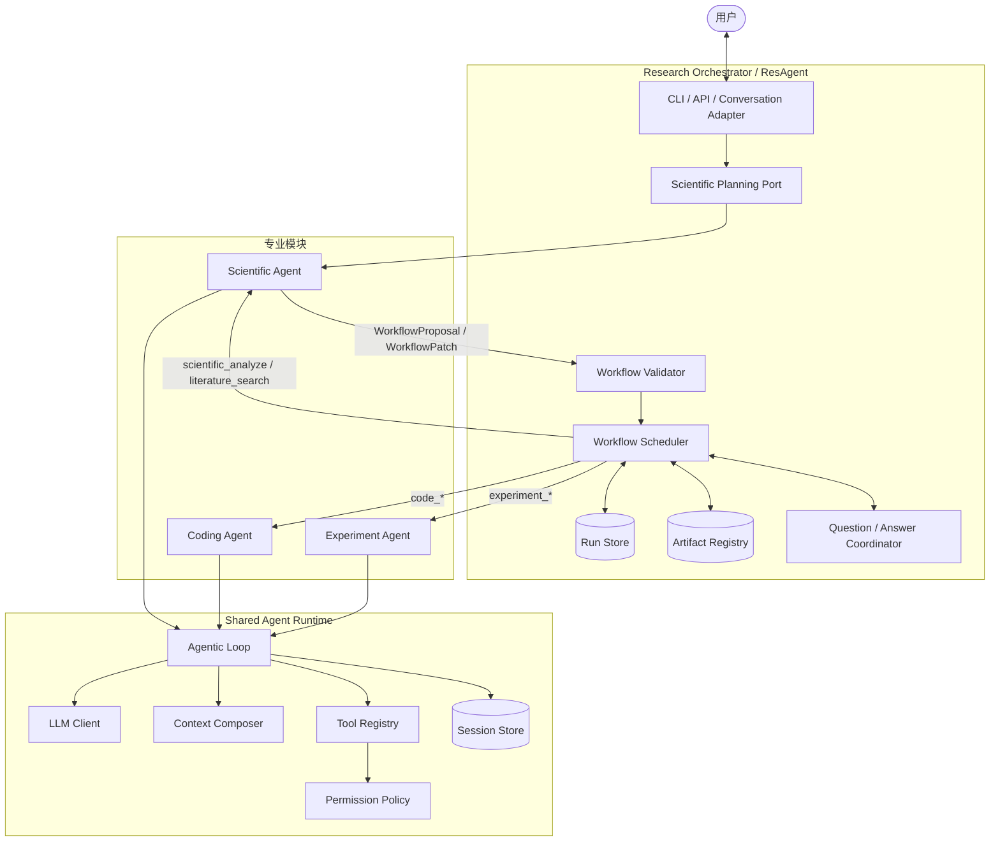
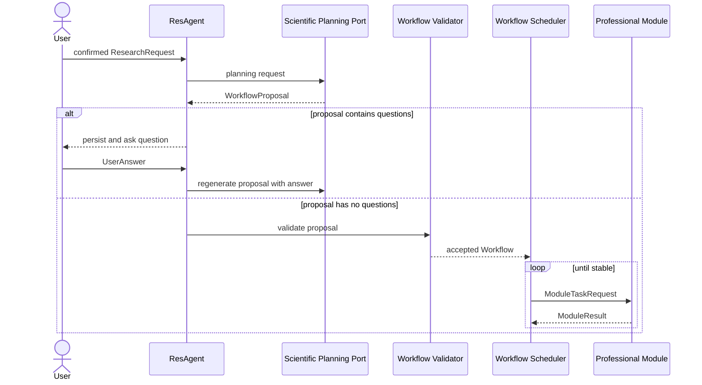
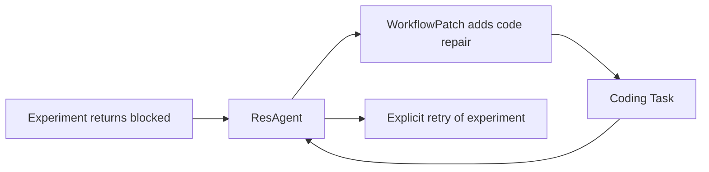
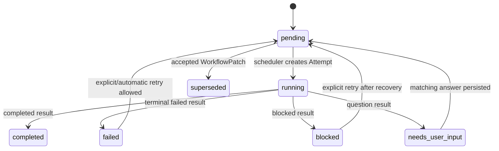
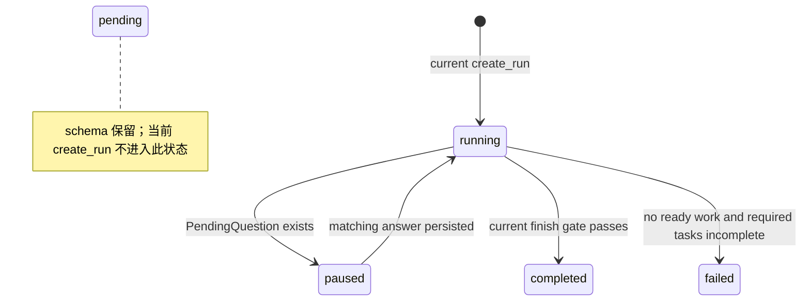

# ResAgent2 系统架构

**文档角色**：系统概念、职责边界和控制流的最高级事实来源（semantic source of truth）

**当前基线**：contracts、shared runtime、Workflow Core v0.1.0、Phase 4 黄金闭环与 Phase 5 原生 Coding Agent 已实现；Phase 5 已完成

**更新规则**：任何改变系统概念、模块职责、控制流或状态语义的变更，必须先修改本文件，再修改契约、计划和代码。

## 1. 文档权威关系

三份核心文档各自只有一个职责，不能互相复制并改写同一规则。

| 问题 | 唯一权威来源 |
|---|---|
| 系统概念、模块职责、控制流、状态含义、架构约束 | `ARCHITECTURE.md` |
| 跨模块对象的字段、类型、组合约束和 wire 版本 | `CONTRACTS.md` |
| 开发顺序、阶段范围、完成状态和验收证据 | `DEVELOPMENT_PLAN.md` |
| 已经运行的代码到底做了什么 | 代码和自动化测试 |
| 难以逆转的架构决定及其理由 | `docs/decisions/` |

`README.md` 是面向新读者的派生摘要，不是另一个权威来源；它必须同步本文件和开发计划的当前状态。

冲突处理顺序：

1. 先按本文件裁定概念和职责；
2. `CONTRACTS.md` 据此表达跨模块数据，不得发明新控制流；
3. `DEVELOPMENT_PLAN.md` 只安排实现和验收，不得重新定义架构；
4. 如果代码尚未符合文档，必须在开发计划中列为明确缺口，不能把目标写成“已实现”。

## 2. 目标与非目标

ResAgent2 是科研工作流控制系统，不是通用聊天机器人。

系统目标：

1. Scientific Agent 可以根据研究问题提出和修订计划；
2. 确定性代码约束依赖、状态、安全、证据和完成条件；
3. Coding、Experiment、Scientific 三个专业 Agent 复用同一套 Agentic Loop；
4. 模块通过稳定契约协作，不读取彼此的内部状态；
5. 用户能通过 Run state、Artifact 和报告理解系统做了什么。

当前不追求：

- 用复杂框架替代清晰的 Python 控制流；
- 让子 Agent 彼此直接调用；
- 把所有未来能力提前抽象进 runtime；
- 把聊天记录当作系统状态；
- 让 LLM 直接决定关键状态转换。

## 3. 核心概念

| 概念 | 准确含义 | 所有者 |
|---|---|---|
| ResearchRequest | 用户确认的研究目标、上下文、约束和总预算 | ResAgent |
| ResearchRun | 一次研究执行的完整持久化状态 | ResAgent |
| WorkflowProposal | Scientific Agent 对“应该做哪些执行任务”的建议，尚不可执行 | Scientific Agent 产生，ResAgent 校验 |
| Workflow | ResAgent 接受并持久化的有版本任务图 | ResAgent |
| WorkflowTask | 调度器可调用一次专业能力的顶层工作单元 | ResAgent |
| Attempt | 某个 WorkflowTask 的一次真实模块调用边界 | ResAgent |
| Session | 子 Agent 内部可恢复的 Agentic Loop 状态 | 子 Agent/runtime |
| AgentAction | Session 内的一次 Tool 调用或 finish 候选 | runtime |
| ModuleTaskRequest | ResAgent 发给一个专业模块的一次调用请求 | ResAgent |
| ModuleResult | 专业模块返回的一次调用结果 | 专业模块 |
| ArtifactCandidate | 模块声明的待登记文件 | 专业模块 |
| ArtifactRef | ResAgent 验证、冻结并登记后的不可变证据引用 | ResAgent |
| PendingQuestion | 已持久化、会暂停 Run 的用户问题 | ResAgent |

必须始终区分三层身份：

```text
WorkflowTask（研究工作单元）
  └─ Attempt（一次模块调用）
       └─ Session（模块内部 Agentic Loop，可被显式恢复）
            └─ AgentAction（单步工具动作）
```

## 4. 总体架构



## 5. 控制面与任务面

### 5.1 控制面

控制面决定“Workflow 是什么”，包括：

- 从 ResearchRequest 生成 WorkflowProposal；
- 校验 Proposal 并创建 Workflow；
- 根据新证据生成 WorkflowPatch；
- 处理用户问题、批准和恢复；
- 判断 Run 是否结束。

`scientific_plan` 属于控制面的 Planning Port。它不是 Workflow 中的 Task，否则会出现“必须先执行一个 WorkflowTask 才能生成这个 Workflow”的递归。

### 5.2 任务面

任务面执行已经接受的 WorkflowTask，包括：

- `scientific_analyze`；
- `literature_search`；
- `code_understand`；
- `code_modify`；
- `experiment_prepare`；
- `experiment_run`。

`ask_user` 也不是普通 WorkflowTask。它是模块通过 `ModuleResult(status=needs_user_input)` 发出的控制信号，由 ResAgent 持久化问题并暂停 Run。

当前 contracts 仍保留 `scientific_plan` 和 `ask_user` 的 capability/input 类型作为过渡接口，但 Workflow validator 会拒绝它们作为 WorkflowTask 进入任务图。它们仅供控制面（Planning Port 与 ask-user 信号）使用，不改变上述架构语义。

## 6. 两种循环

系统只有两种不同层级的循环。

### 6.1 Workflow Scheduler

属于 ResAgent，由确定性代码驱动：

```text
读取 ResearchRun
  → 计算 ready Task
  → 创建并保存 running Attempt
  → 通过 capability 对应的 ModulePort 发出 ModuleTaskRequest
  → 接收并校验 ModuleResult
  → 登记 Artifact、结束 Attempt、更新 Task
  → 处理 retry / blocked / question / WorkflowPatch
  → 执行 finish gate
```

### 6.2 Agentic Loop

属于共享 runtime，在单个模块调用内部运行：

```text
加载或创建 Session
  → 构建本轮上下文
  → LLM 返回类型化 AgentAction
  → schema 与权限检查
  → 执行 Tool 并记录 Observation
  → completion check 生成 ModuleResult
```

Workflow Scheduler 不选择模块内部 Tool；Agentic Loop 不修改顶层 TaskStatus。

## 7. 计划、执行与修订工作流



`WorkflowProposal.questions` 只表示创建 Workflow 前仍需澄清的问题。只要列表非空，Proposal 就不能被接受为 Workflow；回答后应重新规划。`create_run` 会拒绝 questions 非空的 Proposal。

运行中修订使用 `WorkflowPatch`。允许：增加任务、supersede 尚未开始的任务、更新 pending 任务输入或依赖。禁止：修改已经执行的历史、删除 Attempt、把失败直接改成功、修改 running Task 输入、修改已登记 Artifact 内容。

## 8. 模块职责

### 8.1 Research Orchestrator

负责 ResearchRun、Workflow revision、Task/Attempt 状态、capability 路由、重试策略、问题协调、Artifact 登记、Run 预算和 finish gate。

不直接修改代码、运行实验或形成科学结论；不读取和修改子 Agent 的内部 Session。

### 8.2 Scientific Agent

通过两类端口工作：

- 控制面：提出 WorkflowProposal / WorkflowPatch；
- 任务面：检索文献、分析登记证据、形成 ScientificConclusion。

它不选择物理 workspace，不修改 TaskStatus，也不直接调用 Coding 或 Experiment Agent。

### 8.3 Coding Agent

负责理解代码、在授权范围内修改、验证变化并交付代码 Artifact。它不作科学结论，不直接调用其他子 Agent，不扩大 workspace 授权。

### 8.4 Experiment Agent

负责准备仓库和环境、运行实验、收集参数/日志/指标/环境证据并形成结构化结果。它不作最终科学结论，不直接调用 Coding Agent，也不自行创建 repair Task。

### 8.5 Shared Runtime

只提供模块通用机制：Agentic Loop、LLM client、上下文组合、Tool 分发、权限协议、Session/event 持久化和统一错误映射。领域 prompt、领域 Tool、结果 finalizer 和 Workflow Scheduler 不属于共享 runtime。

Phase 5 开始加入第二类共享机制：`WorkspaceBoundary`、无 shell 的 `ProcessRunner`、只读 Git 观察和已登记 Artifact 的只读访问。这些对象只提供物理边界和可审计执行，不决定“应该改什么代码”或“验证是否足以完成 Coding Task”。Coding 的编辑策略和 finalizer 仍属于 Coding Agent。

### 8.6 Phase 5 Coding 执行边界

原生 Coding Agent 同时拥有 `code_understand` 和 `code_modify` 两个 profile，但复用同一个 AgentLoop：

```text
ModuleTaskRequest
  → 校验 capability、WorkspaceGrant 与干净 Git 基线
  → 按 profile 注入只读或可写 Tool
  → AgentLoop 执行动作
  → Coding finalizer 从 Git 状态和真实命令结果生成 payload/ArtifactCandidate
  → ModuleResult
```

`code_understand` 不注入写文件或进程 Tool，并在完成时再次确认 Git 状态未改变。`code_modify` 只允许精确文本替换和新文件创建；写入范围同时受 WorkspaceGrant 与 `CodeModifyInput.allowed_paths` 限制。LLM 不能提交任意 shell 字符串，只能请求执行调用方预先声明的 verification commands；验证前后 Git diff 必须相同，结果还必须绑定最终 diff hash。

Phase 5 原生 Coding Agent 要求已有且干净的 Git workspace。这个限制用于建立 Attempt 级 provenance：finalizer 可以确定哪些变化由本次调用产生。支持脏工作区或非 Git 目录需要先定义独立的 baseline/snapshot 契约，不在本阶段隐式兼容。

两条已知限制：(1) verification command 在无 OS 沙箱的真实子进程中运行，继承环境变量、可越出 workspace，其安全依赖命令由可信调用方预先声明（不做 OS 级隔离）；(2) finalizer 只判定「存在 Git 变更且验证命令通过」，不判定变更是否满足 instructions——后者由调用方声明的 verification command 承担，命令过弱（如恒真断言）时无法证明目标真正达成。

## 9. 模块通信规则

专业模块不能直接互调。跨模块只通过：

- Planning Port 的 ResearchRequest → WorkflowProposal / WorkflowPatch；
- Scheduler 的 ModuleTaskRequest → ModuleResult；
- 已登记 ArtifactRef；
- QuestionDraft → PendingQuestion → UserAnswer。

典型 repair 路径：



## 10. 状态机

状态名以 contracts 中的枚举为准。planning、replanning 是活动，不是持久化 RunStatus；外部进程中断是恢复事件，当前也没有 `interrupted` 状态。

### 10.1 TaskStatus



### 10.2 RunStatus



当前 `create_run` 直接创建 `running`，尚未实际使用 `pending`。崩溃恢复依赖持久化的 ResearchRun；是否增加专门的 `interrupted` 状态必须另立 ADR，不能只改图。

## 11. Artifact 与安全边界

Artifact 采用两道职责不同的检查：

1. **runtime/Tool 执行前**：根据 WorkspaceGrant 做访问授权、路径 resolve、symlink 边界和读写权限检查，防止越权访问；
2. **ResAgent 登记时**：不信任子模块返回的 ArtifactCandidate，重新检查文件存在、相对路径、workspace containment、symlink escape，计算 hash，绑定 run/task/attempt，并复制到冻结位置。

第一道检查保护执行过程，第二道检查保护证据库。两者是纵深防御，不是重复所有权。

只有成功或 completed-with-warnings Attempt 的 ArtifactRef 自动传给依赖任务；失败/blocked Attempt 的诊断 Artifact 可以登记，但不得作为下游成功证据自动传播。

## 12. 完成判定

模块返回的 finish 只是候选。模块自己的确定性 finalizer 负责生成可信 ModuleResult；ResAgent 再依据顶层状态执行 finish gate。

### 12.1 Phase 3 当前已实现 gate

当前 `_evaluate_run` 只检查：

1. 没有 PendingQuestion；
2. 没有 ready 或 running Task；
3. 所有 required、非-superseded Task 都是 completed。

Artifact 的存在、边界、hash 和 provenance 在“登记时”检查，不是在 finish gate 末尾重新检查。

### 12.2 系统最终目标 gate

最终系统还需要：

- required output/evidence 已明确建模且存在；
- 需要科学分析的实验结果已经进入 ScientificConclusion；
- 没有未解决的 required failure；
- final summary 只引用已登记事实。

这些条件目前缺少完整模型和代码，不属于当前 finish gate。Phase 4 的 legacy 黄金闭环只证明任务执行、证据冻结和科学分析链路已经连通，不等于最终科学闭环 gate 已实现；后者在 Phase 7 逐项落到 contracts、代码和测试。

`SuccessCriterion` 当前只被持久化，不被 Scheduler 求值；`evidence_key` 也没有运行期解析器。Task 完成仍由模块 finalizer 的 ModuleStatus 决定。是否让 criterion 进入机器 gate，必须先定义 evidence_key 指向和求值责任，再改契约。

## 13. 当前实现边界

已实现：

- schema 1.0 的 contracts 包；
- provider-neutral 的同步 AgentLoop 和内存测试 Tools；
- 同步单进程 Workflow Scheduler；
- Task/Attempt 状态映射、retry、question pause/answer；
- WorkflowPatch、RunStore、Artifact 冻结登记；
- validator 拒绝 scientific_plan / ask_user 进入 WorkflowTask；
- Scheduler 只消费 ModuleResult 外层状态、Artifact、Session、Question、Error 和 Warning，并把 payload 持久化到 Attempt；跨任务信息仍必须登记为 Artifact；
- PlanningPort 协议与 DeterministicPlanningPort（控制面，不进入任务图）；
- 原生 Coding Agent、Experiment/Scientific 两个剩余 legacy adapter，以及不依赖外部模块的 mock E2E 和服务器真实短闭环；
- runtime AgentLoop 消费 parent_session_id 完成 ask-user resume；
- 只有 completed/completed-with-warnings Attempt 的 Artifact 自动传给依赖任务，失败/blocked Attempt 的诊断 Artifact 不自动传播；
- fake ModulePort 的确定性测试。

尚未实现或尚未对齐：

- Planning Port 的真实 Scientific Agent 实现（当前只有 DeterministicPlanningPort）；
- Proposal.questions 的回答后重新规划生命周期（当前仅拒绝非空，回答重规划未实现）；
- success criteria 求值；
- 最终科学闭环 gate 和 final summary；
- 真实 filesystem/process/Git Tools；
- Experiment 与 Scientific 两个 vNext 专业 Agent。

Coding Agent vNext 已通过 deterministic tests、orchestrator Artifact E2E 和服务器真实闭环；当前 Coding 路径不再使用 legacy adapter。

历史说明：Phase 4 的旧 CodingAgent 曾允许“失败 Attempt 已改工作区、成功 retry 却缺少 `code_change` Artifact”的有界兼容例外。Phase 5 删除 legacy Coding adapter 后该例外不再属于当前执行路径；原生 Coding Task 必须登记 `code_patch` 和至少一个当前文件 `code_change` Artifact。

具体阶段和验收状态只见 `DEVELOPMENT_PLAN.md`；字段定义只见 `CONTRACTS.md`。

## 14. 不可破坏的架构约束

1. 顶层只有 WorkflowTask；模块内部只有 AgentAction，不再增加平行的“任务/动作”模型。
2. LLM 可以提出计划和动作，不能直接写 TaskStatus、RunStatus 或 ArtifactRef。
3. `scientific_plan` 在控制面，`ask_user` 是控制信号，二者不作为普通 WorkflowTask 调度。
4. 子 Agent 不直接互调，也不读取另一个 Agent 的 Session。
5. summary、prompt 文本和 metadata 都不能替代机器字段。
6. retry 创建新 Attempt；resume 可以引用旧 Session；repair 是新的 WorkflowTask。
7. ArtifactCandidate 不是证据，只有登记后的 ArtifactRef 才是。
8. 共享 runtime 只抽取至少两个模块语义一致的机制，领域策略留在模块内。
9. 文档必须明确区分目标、当前实现和已知缺口。
