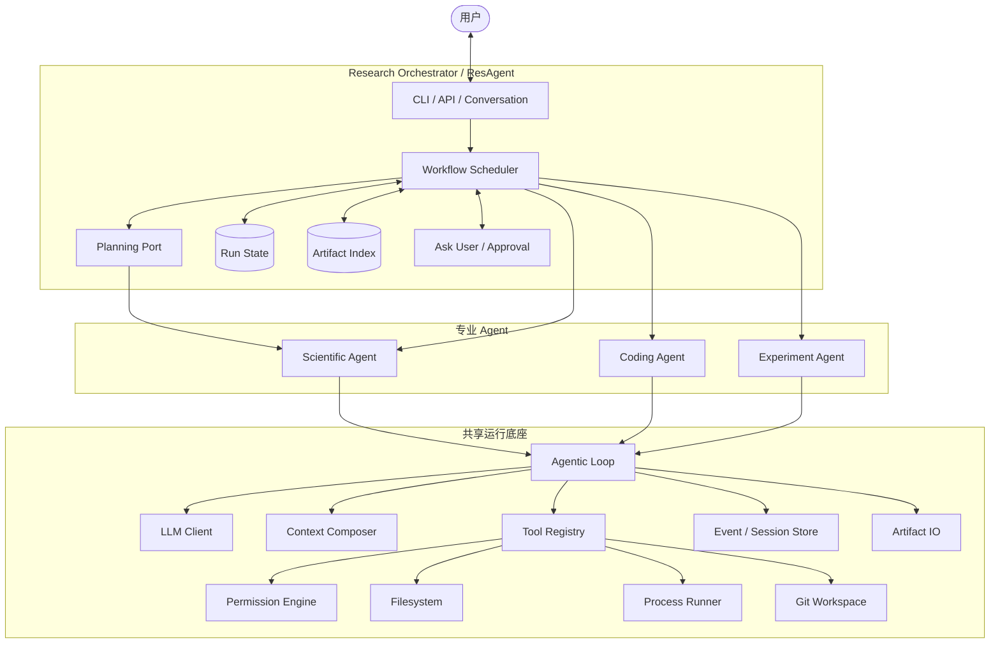
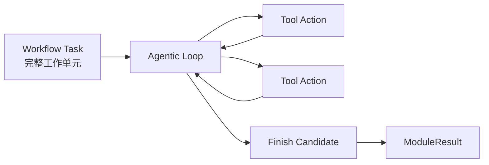
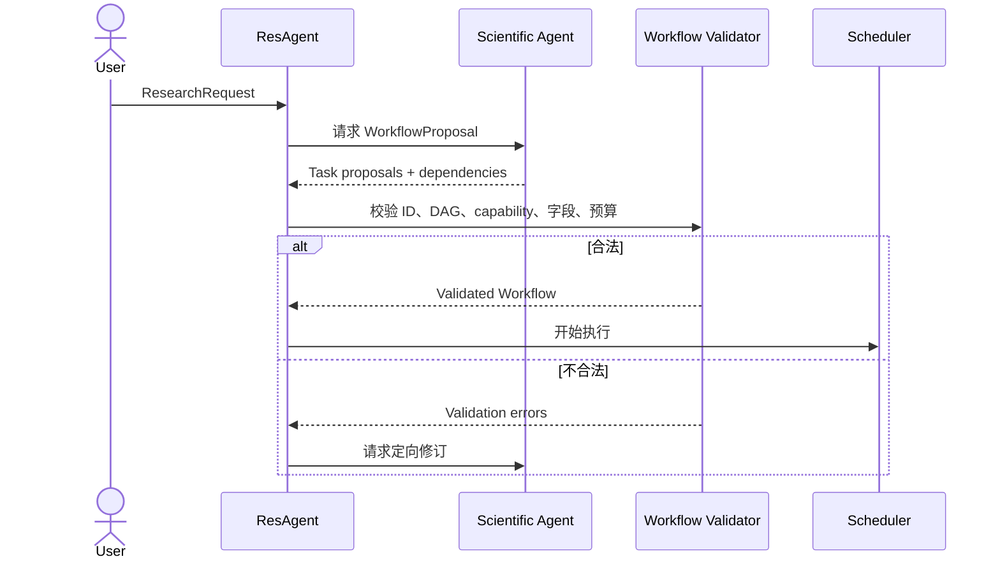
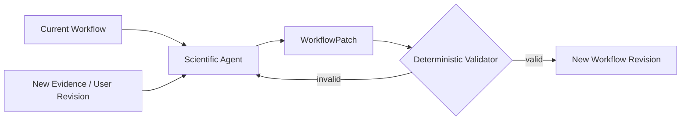
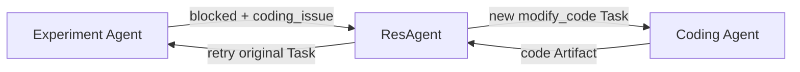
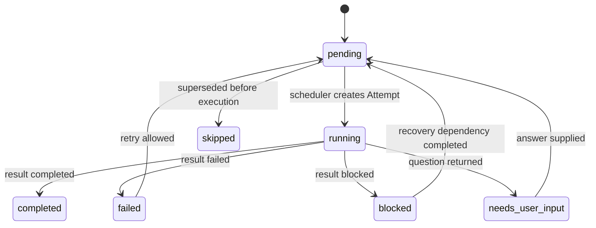
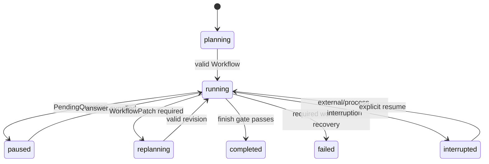

# ResAgent2 系统架构

**状态**：目标架构；contracts 和最小 shared runtime v0.1.0 已实现
**更新规则**：实现状态变化时，本文件必须和代码在同一 commit 更新。

## 1. 系统目标

ResAgent2 是科研工作流的控制系统，不是通用聊天机器人。

系统必须同时做到：

1. 允许 LLM 根据研究问题生成和修订任务计划；
2. 用确定性代码约束任务依赖、状态、安全、证据和完成条件；
3. 让三个专业 Agent 复用同一套 Agentic Loop 和通用能力；
4. 保持各模块职责、状态和输出相对独立；
5. 让用户能从状态文件、Artifact 和文档理解系统当前在做什么。

## 2. 总体架构



## 3. 两种循环

系统中存在两种循环，它们不能混为一谈。

### 3.1 Workflow Scheduler：管理完整研究过程

它属于 ResAgent，由代码驱动：

```text
读取 Workflow 状态
  → 计算依赖已满足的 pending Task
  → 创建 Attempt
  → 调用 capability 对应模块
  → 接收 ModuleResult
  → 更新 Task / Attempt / Artifact
  → 处理失败、等待用户或计划修订
  → 检查 Run 是否可以完成
```

### 3.2 Agentic Loop：模块内部完成一个任务

它属于共享 runtime，由 LLM 与确定性校验共同驱动：

```text
读取 Agent State
  → Context Builder 构建本轮输入
  → LLM 返回类型化 AgentAction
  → Permission / Schema 校验
  → Tool Executor 执行动作
  → 记录 Observation
  → Completion Check
```

关系：



Workflow Task 例如“运行 baseline 实验”；Tool Action 例如“读取配置文件”或“执行 python train.py”。

## 4. 为什么 ResAgent 是确定性的

“确定性”不表示不使用 LLM。它表示关键状态转换由代码规则决定。

### LLM 可以决定

- 初始任务建议；
- 任务目标、理由和依赖建议；
- 发现新证据后的计划修订建议；
- Agent 内部下一步使用哪个允许的 Tool；
- 科学分析和自然语言解释。

### LLM 不能决定

- 不满足依赖的 Task 可以运行；
- 一个失败 Attempt 变成 completed；
- 一个未验证文件变成 Artifact；
- 是否超过预算或权限；
- 是否存在 PendingQuestion；
- required Task 未完成时 Run 可以结束；
- 旧 Attempt 证据可以被覆盖。

### 计划生成和执行的边界



## 5. 简化的任务图

保留动作图的价值，但删除旧系统中重叠的 Action 概念。

顶层只使用 `WorkflowTask`：

```python
WorkflowTask(
    id="run_treatment",
    capability="execute_experiment",
    goal="运行 treatment 并记录验证集指标",
    depends_on=["implement_method"],
    input_artifacts=["code_patch_001"],
    required=True,
    success_criteria=["产生 metrics.json"],
)
```

模块内部只使用 `AgentAction`：

```python
AgentAction(
    tool="run_command",
    arguments={"argv": ["python", "train.py"]},
)
```

禁止再出现多套近义名称，例如 `ScientificAction + AgentTask + PlannedAction + ControllerAction` 同时表达顶层任务。

## 6. 动态工作流

工作流不是固定模板。初始图可以由 LLM 生成，运行中也可以修订，但修订必须显式发生。

允许触发计划修订的事件：

- 用户修改研究目标；
- 模块返回 blocked 且需要新的恢复任务；
- 新实验结果表明需要补充实验；
- Scientific Agent 分析后提出必要后续工作；
- 当前图没有 ready Task 且 required 目标尚未满足。

修订使用 `WorkflowPatch`：

```text
add_tasks
supersede_tasks
update_pending_task_inputs
update_pending_task_dependencies
reason
```

WorkflowPatch 禁止：

- 修改 completed Task 历史；
- 删除 Attempt；
- 把 failed Task 直接改 completed；
- 修改 Artifact 内容；
- 改变 running Task 的输入。



## 7. 模块职责

### 7.1 Research Orchestrator

负责：

- ResearchRun；
- Workflow 和 Workflow revision；
- Task、Attempt、ArtifactRef；
- capability 路由；
- 调度和依赖；
- retry policy；
- Ask User；
- Run 级预算；
- finish gate。

不负责：

- 直接修改代码；
- 直接执行实验；
- 形成科学结论；
- 修改子 Agent 内部状态。

### 7.2 Scientific Agent

负责：

- 科学问题分析；
- 初始 WorkflowProposal；
- WorkflowPatch 建议；
- 文献检索与证据解释；
- 结果分析和 ScientificConclusion。

不负责：

- 选择物理路径和环境；
- 修改 TaskStatus；
- 自己运行 Coding/Experiment Agent。

### 7.3 Coding Agent

负责：

- 代码理解；
- 受限范围内修改代码；
- 运行验证；
- 交付完整代码变化和风险。

不负责：

- 科学判断；
- 直接调用 Experiment Agent；
- 扩大 ResAgent 授权的 workspace。

### 7.4 Experiment Agent

负责：

- 仓库和环境准备；
- 实验执行；
- 参数、日志、指标和环境证据；
- 结构化 ExperimentResult。

不负责：

- 最终科学结论；
- 直接调用 Coding Agent；
- 自己决定创建 repair Task。

## 8. 共享运行底座

### 8.1 Agentic Loop

同一个 Loop 实现，注入 `AgentDefinition`：

```python
AgentDefinition(
    name=...,
    prompt=...,
    tools=...,
    context_builder=...,
    action_type=...,
    result_type=...,
    permission_policy=...,
    completion_check=...,
)
```

### 8.2 通用能力

| 能力 | 是否共享 | 模块差异放在哪里 |
|---|---|---|
| LLM 调用、重试、usage | 共享 | model/profile 配置 |
| Context section 和 token 预算 | 共享框架 | 各 Agent 定义内容和优先级 |
| Tool registry/dispatch | 共享 | 各 Agent 绑定不同 tools |
| 文件路径安全 | 共享 | 各 Agent 的允许根和读写策略 |
| Process runner | Coding/Experiment 共享 | 命令策略、环境、timeout |
| Git mechanics | Coding/Experiment 共享 | clone/copy/in-place policy |
| Ask User signal | 共享契约 | 由 ResAgent 实际展示与恢复 |
| Artifact IO | 共享 | 各 Agent 的 result schema |
| Session/event store | 共享 | 各 Agent 的状态 payload |
| 科学 validator | 不共享 | Scientific Agent |
| patch finalizer | 不共享 | Coding Agent |
| experiment evidence finalizer | 不共享 | Experiment Agent |
| Workflow scheduler | 不共享 | ResAgent |

共享机制，不共享领域策略。

### 8.3 Phase 2 已实现边界

`resagent2_runtime` 当前提供一个同步、provider-neutral 的 AgentLoop：

- AgentDefinition 注入 prompt、LLM client、Tools、ContextBuilder、PermissionPolicy 和 CompletionCheck；
- AgentAction 与每个 Tool 的输入都经过 Pydantic schema 校验；
- 权限检查发生在 Tool 执行之前；
- Tool 返回 ToolObservation，不直接修改 AgentState；
- 每个 action、observation 和 error 都进入事件列表并保存完整内存快照；
- ask_user 只产生 QuestionDraft 和 paused SessionRef；
- FinishCandidate 的 proposed_status 不参与最终状态决定；
- timeout、step budget、LLM-call budget 和内部边界错误统一映射为 ModuleError。

当前 Store、Tools 和 LLM client 都是内存/测试实现，只支持创建新 Session。真实 provider、磁盘恢复、resume、Artifact IO、filesystem/process/Git 均属于后续阶段。

## 9. Ask User

子 Agent 不直接读取终端或维护用户对话，只返回：

```json
{
  "status": "needs_user_input",
  "question": {
    "text": "请选择数据集路径",
    "requested_fields": ["dataset_path"]
  }
}
```

ResAgent 负责生成 `question_id`、暂停 Run、保存回答并创建新的调度机会。

## 10. 模块之间如何通信

子 Agent 禁止直接互调：



通信只通过：

- ModuleTaskRequest；
- ModuleResult；
- ArtifactRef；
- Question；
- Workflow revision。

## 11. 主要状态机

### Task



### Run



## 12. 完成判定

模块的 `finish` 只是候选结果。确定性 finalizer 必须检查证据后生成 ModuleResult。

Run completed 必须满足：

- required Task 全部完成；
- 没有 running Attempt；
- 没有 PendingQuestion；
- required Artifact 存在并通过 provenance 校验；
- 需要科学分析的 ExperimentResult 已被 Scientific Agent 分析；
- 没有未解决的 required failure；
- final summary 只引用已登记事实。

## 13. 实现状态

| 组件 | 状态 |
|---|---|
| 文档与目录基线 | 本阶段建立 |
| contracts package | 已实现 v0.1.0；22 个契约测试通过 |
| shared runtime | 已实现 v0.1.0；14 个 runtime 测试通过 |
| Workflow Scheduler | 未实现 |
| Scientific Agent vNext | 未实现 |
| Coding Agent vNext | 未实现 |
| Experiment Agent vNext | 未实现 |
| legacy adapters | 未实现 |
| golden workflow E2E | 未实现 |

实施顺序和每阶段验收见 `DEVELOPMENT_PLAN.md`。
