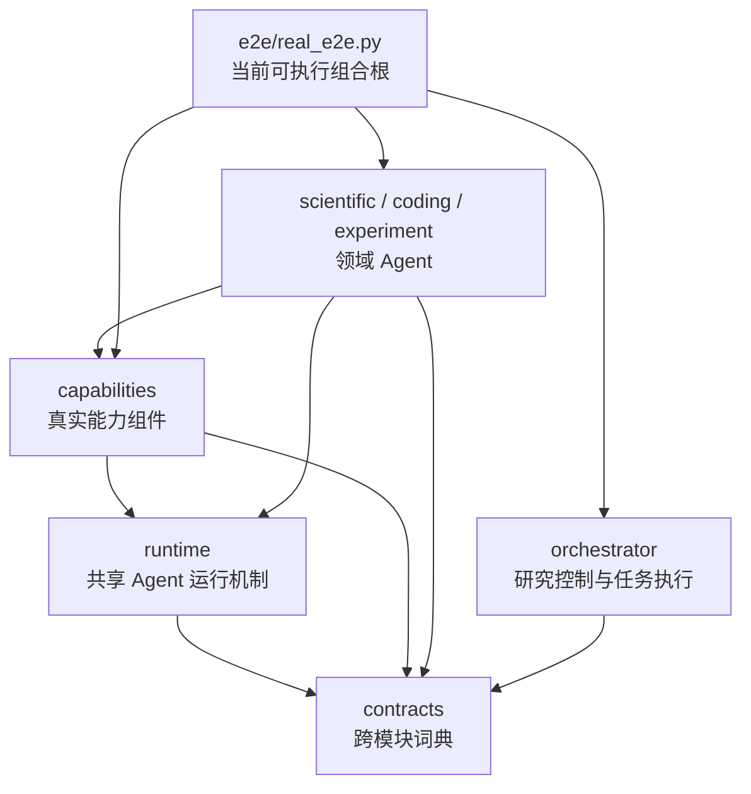
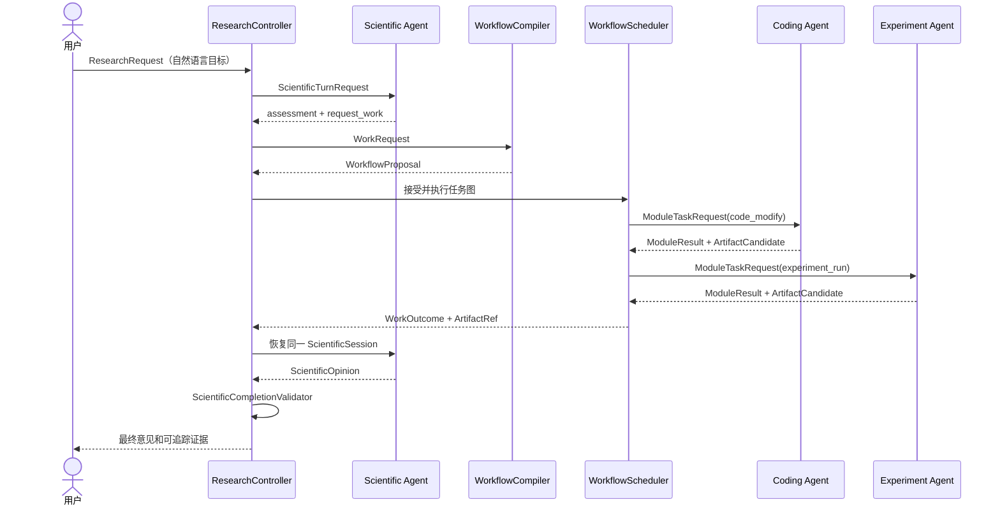

# ResAgent2 项目理解与代码导览

本文不是一张“按顺序打开文件”的清单，而是一份帮助开发者建立系统心智模型的教程。目标是让你先理解 ResAgent2 为什么这样设计、各模块怎样合作、数据为什么这样流动，再把这些概念对应到代码。

本文只描述当前 Stabilization 3.0 / schema 3.0。概念与职责的最高权威仍是 `ARCHITECTURE.md`，字段的最高权威是 `CONTRACTS.md`；本文负责把它们讲得更容易理解，不创造第二套规则。

如果只记一句话：

> Scientific Agent 负责科学判断；ResearchController 负责研究闭环；WorkflowCompiler 把科学需求翻译成任务图；WorkflowScheduler 执行任务图；Coding/Experiment Agent 完成专业工作；runtime 提供共享 Agent 循环；capabilities 提供真实能力。

---

## 1. 这个项目解决什么问题

用户给系统的不是一张写好的任务图，而是一个自然语言科研目标，例如：

```text
判断在当前代码和数据条件下，加入 SE block 是否能提高 CIFAR-10 分类准确率。
```

系统需要完成的不是一次 LLM 问答，而是一个可以持续、暂停、恢复、执行和审计的研究闭环：

```text
理解研究目标
  → 形成当前科学判断
  → 判断还缺什么证据
  → 把证据需求变成可执行任务
  → 修改代码、运行实验
  → 冻结并登记证据
  → 用新证据更新科学判断
  → 得到最终观点，或明确为什么无法下结论
```

普通聊天模型可以给出“看起来合理”的方案，但它通常不能可靠回答这些工程问题：

- 任务是否真的执行了？
- 代码修改是否经过验证？
- 实验结果来自哪个文件、哪次尝试？
- 中途失败后是否可以修复并继续？
- 用户回答问题后能否跨进程恢复？
- 最终观点引用的证据是否真的被 Scientific Agent 读过？

ResAgent2 的价值就是把开放的 LLM 推理和确定性的工程控制组合起来。

---

## 2. 先区分“系统角色”和“代码包”

这是理解项目最重要的第一步。

### 2.1 四个系统角色


| 角色                             | 简单类比       | 负责                                                         | 不负责                                   |
| -------------------------------- | -------------- | ------------------------------------------------------------ | ---------------------------------------- |
| ResAgent / Research Orchestrator | 神经系统和总管 | Run 状态、工作请求、任务图、调度、预算、问题、证据、最终闭环 | 自己形成科学观点、改代码、跑实验         |
| Scientific Agent                 | 科学大脑       | 当前科学判断、还缺什么证据、最终科学意见                     | 输出执行图、选择文件、直接调用其他 Agent |
| Coding Agent                     | 程序员         | 阅读项目、修改代码、准备环境、运行验证                       | 判断实验是否支持科学假设                 |
| Experiment Agent                 | 实验员         | 准备环境、运行实验、采集指标和证据                           | 修改产品代码、形成最终科学结论           |

Scientific、Coding、Experiment 是三个 Agent。WorkflowCompiler 和 WorkflowScheduler 不是 Agent，而是 ResAgent 内部的组件。

### 2.2 六类代码包


| 目录                                    | 含义                                                           |
| --------------------------------------- | -------------------------------------------------------------- |
| `packages/contracts`                    | 系统共同使用的词典：跨模块对象、字段和状态                     |
| `packages/runtime`                      | 通用 Agent 运行机制：循环、Tool、上下文、LLM、Session          |
| `packages/capabilities`                 | 可复用真实能力：文件、Git、进程、环境、数据集、仓库、文献      |
| `packages/orchestrator`                 | ResAgent 的实现：Controller、Compiler、Scheduler、Run/Artifact |
| `packages/agents/scientific`            | Scientific Agent 的 prompt、tools、context 和 finalizer        |
| `packages/agents/coding` / `experiment` | Coding、Experiment Agent 的领域实现                            |

因此，“模块”在讨论中可能指系统角色，也可能指 Python package。阅读时要先问：这里说的是哪个层级？

### 2.3 依赖方向



关键约束：

- orchestrator 不 import 具体 Agent，而是依赖 Port；
- runtime 不知道 Coding、Experiment 或 Scientific；
- capabilities 不包含 Agent prompt 和任务调度；
- 三个 Agent 不能直接互相调用；
- 只有组合根知道所有具体实现，并把它们装配起来。

当前仓库还没有最终聊天界面或产品 CLI。`ResearchController` 是程序化入口，`e2e/real_e2e.py` 展示当前完整装配方式。

---

## 3. 一次 ResearchRun 是怎样完成的

先看完整故事，再看类和字段。



具体分成九步：

1. 用户提交 `ResearchRequest`，里面是目标、约束、预算、输入 Artifact 和数据集声明；工作区由组合根单独声明并注入 Scheduler；
2. `ResearchController` 创建并持久化 `ResearchRun`；
3. Scientific Agent 根据目标和现有证据形成 `ScientificAssessment`；
4. 如果证据不足，它返回 `WorkRequestDraft`，只描述“还需要什么工作/证据”；
5. Controller 把 Draft 变成有 ID、有状态的 `WorkRequest`；
6. `WorkflowCompiler` 把语义请求翻译成 `WorkflowProposal` 或只追加的 `WorkflowPatch`；
7. `WorkflowScheduler` 根据依赖执行 `WorkflowTask`，每次真实模块调用形成一个 `Attempt`；
8. Coding/Experiment 返回文件候选，ResAgent 校验、复制、计算哈希后形成不可变 `ArtifactRef`；
9. 图稳定后生成 `WorkOutcome`，恢复同一个 ScientificSession，直到 `finish` 或 `ask_user`。

这条链是整个项目的主干。其他类型、状态和工具都在服务它。

---

## 4. 必须分清的核心概念

### 4.1 从研究到单步动作的层级

```text
ResearchRequest：用户要研究什么
└─ ResearchRun：这次研究的完整生命周期
   ├─ ScientificSession：跨多轮工作的长期科学推理会话
   └─ WorkRequest：当前还需要什么证据
      └─ Workflow revision：ResAgent 当前怎样安排执行
         └─ WorkflowTask：一个顶层专业任务
            └─ Attempt：这次任务的一次真实调用
               └─ Session：Coding/Experiment 内部 Agent 会话
                  └─ AgentAction：一次 Tool 动作
```

最容易混淆的四组概念：

#### WorkRequest 和 WorkflowTask

- WorkRequest 是科学语义，例如“需要一组基线与候选模型的可比较实验结果”；
- WorkflowTask 是执行语义，例如“修改代码实现 SE block”“运行训练脚本”；
- Scientific Agent 只产生前者；Compiler/ResAgent 产生后者。

#### WorkflowTask 和 Attempt

- Task 是任务身份；
- Attempt 是一次执行记录；
- 普通失败重试会创建新 Attempt；
- `ask_user` 后恢复属于同一次 Attempt，不应该伪装成重试。

#### Attempt 和 Session

- Attempt 属于 ResAgent 的调度层；
- Session 属于 runtime 的 Agent 内部状态；
- Coding/Experiment Session 绑定具体 Attempt；
- ScientificSession 绑定整个 ResearchRun，可以跨多个 WorkRequest。

#### ArtifactCandidate 和 ArtifactRef

- Agent 只能说“我产生了这个文件”，得到 `ArtifactCandidate`；
- ResAgent 重新检查路径、权限、文件存在性和 provenance，冻结复制并计算哈希；
- 登记完成后的不可变证据才是 `ArtifactRef`。

### 4.2 三套状态各管什么


| 状态                             | 描述                                                                              |
| -------------------------------- | --------------------------------------------------------------------------------- |
| `RunStatus`                      | 整次研究：running / paused / completed / failed                                   |
| `TaskStatus`                     | 一个顶层任务：pending / running / completed / failed / blocked / needs_user_input |
| `AttemptStatus` / `ModuleStatus` | 一次模块执行怎样结束                                                              |

单个实验 Task 失败不等于 ResearchRun 失败。失败先进入 `WorkOutcome`，Scientific Agent 可以请求修复任务；只有整个控制闭环不可恢复或预算耗尽时，Run 才失败。

---

## 5. 系统里其实有三种不同的“循环”

### 5.1 Scientific 控制循环

跨度是整个 ResearchRun：

```text
科学判断
  → request_work / ask_user / finish
  → 等待工作结果或用户回答
  → 恢复同一个 ScientificSession
  → 更新科学判断
```

它决定研究下一步需要什么，但不执行任务图。

### 5.2 Workflow 调度循环

由确定性 Scheduler 驱动：

```text
找 ready Task
  → 创建/恢复 Attempt
  → 调用 ModulePort
  → 校验 ModuleResult
  → 登记 Artifact
  → 更新 Task
  → 直到图稳定
```

它决定哪个 Task 现在可以执行，但不决定 Agent 内部下一步调用哪个 Tool。

### 5.3 Agentic Loop

Scientific、Coding、Experiment 共用同一套 `AgentLoop`：

```text
构建上下文
  → LLM 选择一个类型化 AgentAction
  → schema / 权限校验
  → 执行 Tool
  → 保存 ToolObservation
  → 确定性 completion check
  → 继续或返回 ModuleResult
```

三个 Agent 的差异不是三套框架，而是：

- system prompt；
- 可用 tools；
- context sections；
- permission policy；
- deterministic finalizer。

WorkflowCompiler 不属于这三种循环。它是一次短调用：语义草图 → 确定性物化 → 一次语义审查。

---

## 6. 理解架构后，再看 contracts

### 6.1 contracts 到底是什么

contracts 不是业务实现，也不是数据库模型集合。它是模块之间共同使用的语言。

例如 Scheduler 不应该读取 Coding Agent 的内部 memory。它只知道：

```text
发送 ModuleTaskRequest
收到 ModuleResult
```

这使 Agent 内部实现可以变化，而上游仍然只依赖稳定语义。

### 6.2 主要模块边界


| 发送方            | 接收方            | 契约                                             | 准确语义                                                    |
| ----------------- | ----------------- | ------------------------------------------------ | ----------------------------------------------------------- |
| 用户/入口         | Controller        | `ResearchRequest`                                | 用户确认的研究目标、约束和总预算                            |
| Controller        | Scientific        | `ScientificTurnRequest`                          | 本轮允许 Scientific 看到的目标、状态、回答和证据            |
| Scientific        | Controller        | `ScientificTurnResult`                           | 当前观点以及 request_work / ask_user / finish / failed 之一 |
| Scientific        | Controller        | `WorkRequestDraft`                               | 还缺什么工作，不含 capability、TaskId 或依赖图              |
| Controller        | Compiler          | `WorkRequest`                                    | 已持久化、可追踪的语义工作请求                              |
| Compiler          | Controller        | `WorkflowProposal/Patch`                         | 尚未接受的执行图候选                                        |
| Scheduler         | Coding/Experiment | `ModuleTaskRequest`                              | 一个 Attempt 被授权执行的目标、输入、工作区和预算           |
| Coding/Experiment | Scheduler         | `ModuleResult`                                   | 强类型状态、payload、问题、错误和 ArtifactCandidate         |
| Scheduler         | Scientific        | `WorkOutcome`（经 Controller）                   | 一次 WorkRequest 稳定后的成功、失败、警告和证据汇总         |
| Agent             | Controller/User   | `QuestionDraft → PendingQuestion → UserAnswer` | 可以持久化并跨进程恢复的问题链                              |

### 6.3 阅读 contracts 的正确方法

不要从 `models.py` 第一行开始背字段。每遇到一个边界对象，按四个问题理解：

1. 谁生产它？
2. 谁验证它？
3. 保存在哪里？
4. 谁消费它，消费字段是为了什么？

推荐按主链查这些对象：

```text
ResearchRequest
→ ScientificTurnRequest / ScientificTurnResult
→ WorkRequestDraft / WorkRequest
→ WorkflowProposal / WorkflowPatch / WorkflowTask
→ ModuleTaskRequest / ModuleResult
→ Attempt / WorkOutcome
→ ArtifactCandidate / ArtifactRef
→ ScientificOpinion
```

字段含义查 `docs/CONTRACTS.md`，Python 类型和 validator 查 `packages/contracts/src/resagent2_contracts/models.py`。

---

## 7. 每个代码模块内部有什么

### 7.1 orchestrator：研究控制与任务执行


| 文件            | 作用                                                   |
| --------------- | ------------------------------------------------------ |
| `controller.py` | 唯一 Run 入口；驱动 Scientific、WorkRequest 和最终闭环 |
| `compiler.py`   | WorkRequest → 语义 Draft → Proposal/Patch            |
| `scheduler.py`  | 执行 WorkflowTask/Attempt、问题恢复、生成 WorkOutcome  |
| `ports.py`      | orchestrator 调用外部实现的边界，如 ModulePort         |
| `models.py`     | `ResearchRun` 等 orchestrator 内部持久状态             |
| `store.py`      | RunStore 与 JSON 持久化                                |
| `artifacts.py`  | Artifact 校验、冻结、登记                              |
| `completion.py` | ScientificCompletionValidator 与 final report          |
| `layout.py`     | Run state、Attempt 输出、Artifact 的目录约定           |

先理解 `ResearchController`，再看 Compiler 和 Scheduler。不要从 Scheduler 的每个状态分支开始读，否则会看到大量细节但不知道为什么存在。

### 7.2 runtime：三个 Agent 共用的发动机


| 文件         | 作用                                                         |
| ------------ | ------------------------------------------------------------ |
| `loop.py`    | AgentLoop 主循环、错误恢复、预算和 completion decision       |
| `models.py`  | AgentDefinition、AgentState、Action/Observation 等运行期模型 |
| `tools.py`   | Tool 协议与分发                                              |
| `context.py` | 有预算和优先级的上下文组合                                   |
| `llm.py`     | OpenAI-compatible client、transport retry、LLM trace         |
| `store.py`   | SessionStore 和 JsonSessionStore                             |

runtime 只解决“Agent 怎么运行”，不包含 read_file、git 或 scientific_finish 等领域 Tool。

### 7.3 capabilities：可复用的真实能力


| 能力组         | 主要文件                                 | 含义                                   |
| -------------- | ---------------------------------------- | -------------------------------------- |
| 工作区边界     | `workspace.py`, `workspace_tools.py`     | 路径解析、授权、读写文件               |
| Git 与变更基线 | `git.py`, `snapshot.py`                  | Attempt 级差异和统一 WorkspaceSnapshot |
| 进程           | `process.py`                             | shell-free 命令执行和环境变量清理      |
| 仓库           | `repo.py`                                | clone/copy/generated 工作区物化        |
| 环境           | `environment.py`, `environment_tools.py` | prepare/setup/audit 和环境生命周期     |
| 数据集         | `dataset.py`, `resources.py`             | DatasetRef 解析与共享资源目录          |
| Artifact 读取  | `artifacts.py`                           | 只读已登记 Artifact                    |
| 文献           | `literature.py`                          | 文献后端和规范化候选证据               |
| 硬件           | `hardware.py`                            | 实验硬件审计上下文                     |

capability 是可以被不同 Agent 复用的能力组件，不是一个新 Agent，也不应该知道 ResearchRun 的控制策略。

### 7.4 三个 Agent 的共同结构

每个 Agent 包基本都有：

```text
agent.py       组装 prompt、tools、context、policy、finalizer
context.py     把领域状态转换成 LLM 可见上下文
models.py      Agent 内部 action/payload 类型
tools.py       领域控制 Tool（如果需要）
completion.py  确定性完成/失败判断
```

Scientific 的核心是“观点和证据引用”；Coding 的核心是“工作区增量和验证”；Experiment 的核心是“真实命令、指标与实验文件证据”。

---

## 8. 哪些交给 LLM，哪些必须由代码决定

这是项目最核心的设计理念。


| LLM 擅长并被允许做       | 确定性代码必须负责                  |
| ------------------------ | ----------------------------------- |
| 理解自然语言科研目标     | 分配 Run/Task/Attempt/Artifact ID   |
| 形成科学观点和局限       | 状态迁移和持久化                    |
| 判断还缺什么类型的证据   | DAG、capability、预算和作用域校验   |
| 把语义需求草拟为任务关系 | 物理工作区和权限边界                |
| 阅读代码并决定怎样修改   | 记录真实 diff 和验证命令结果        |
| 根据报错选择下一步 Tool  | 判断 Tool 是否成功、是否连续失败    |
| 解释实验结果             | 冻结文件、计算哈希和验证 provenance |

简单说：

> LLM 决定“语义上应该做什么”；代码决定“这个动作是否合法、实际发生了什么、系统状态如何变化”。

这不是为了限制 LLM，而是让 LLM 的优势用在语义判断上，同时把身份、状态、安全和证据这些不能靠猜的事情交给代码。

---

## 9. 状态为什么分成 RunStore、SessionStore 和 ArtifactRegistry

系统没有把所有东西塞进一份聊天记录。


| 存储             | 保存什么                                                                | 为什么分开                                              |
| ---------------- | ----------------------------------------------------------------------- | ------------------------------------------------------- |
| RunStore         | ResearchRun、Workflow、Task、Attempt、WorkRequest、问题和 Artifact 索引 | 跨模块的公开、可恢复事实                                |
| SessionStore     | Agent 的 Action/Observation/memory 历史                                 | Agent 私有运行状态，可恢复但不应被上游随意读取          |
| ArtifactRegistry | 冻结文件和 hash/provenance                                              | 大文件证据不能塞进 Run JSON，也不能信任原工作区一直不变 |

工作区也分三层：

- `WorkspaceSpec`：调用方声明来源；
- `WorkspaceRecord`：物化后的真实 root 和 source；
- `WorkspaceGrant`：某个 Attempt 被允许访问的物理边界。

环境和数据集是共享资源，不应写进代码仓库；Run state、Attempt 输出和 Artifact 是一次 Run 的数据，不应写进共享缓存。`ResourceLayout` 与 `RunLayout` 就是在表达这一区别。

---

## 10. 沿 code-experiment 场景走一遍代码

这是最适合第一次跟代码的主链。

### 第一步：装配系统

看 `e2e/real_e2e.py::_build_controller`：

- 创建 LLM client；
- 创建 RunStore、SessionStore、ArtifactRegistry；
- 注册 code_modify / experiment_run 等 capability；
- 构造三个 Agent 和对应 Port；
- 把 Compiler、Scheduler、ScientificPort 注入 ResearchController。

这一处回答“对象是怎样连起来的”。

### 第二步：创建 Run

看 `ResearchController.create_run`：

- 接收 ResearchRequest；
- 冻结并登记调用方提供的 input artifact；
- 创建 running ResearchRun；
- 保存后进入 `run_until_stable`。

workspace 并不是 `ResearchRequest` 的字段。组合根在构造 `WorkflowScheduler` 时注入 `WorkspaceSpec`；Scheduler 接受任务图时才把声明解析为本 Run 的 `WorkspaceRecord`。这样用户目标与部署/工作区装配保持分离。

### 第三步：Scientific 请求工作

看 Controller 的 `_scientific_turn` 和 `_apply_turn`，再看 Scientific Agent 的 `agent.py/tools.py/completion.py`：

- Scientific 读取目标；
- 返回 assessment + WorkRequestDraft；
- Controller 分配 WorkRequestId 并持久化。

### 第四步：编译任务图

看 `LLMWorkflowCompiler.compile` 和 `_materialize_draft`：

- LLM 只产生局部 task key、capability、goal、depends_on、inputs；
- 代码分配全局 TaskId、绑定 WorkRequestId、解析 workspace；
- validator 拒绝空图、未知能力、跨请求依赖和提前编排的条件修复任务。

### 第五步：Scheduler 执行

看 `WorkflowScheduler.run_until_stable`、`execute_task`、`_start_task`、`_invoke`：

- 找到 ready Task；
- 创建 Attempt 和 Attempt 输出目录；
- 构造 ModuleTaskRequest；
- 通过 ModulePort 调用 Coding 或 Experiment；
- 登记结果和 Artifact。

### 第六步：进入 AgentLoop

以 Coding 为例，看 `resagent2_coding/agent.py` 怎样构造 `AgentDefinition`，然后进入 `AgentLoop.run`：

- context builder 告诉 LLM 当前目标、文件和控制状态；
- LLM 发出 read_file / replace_text / run_verification / finish；
- Tool 执行结果形成 ToolObservation；
- completion check 根据真实 workspace diff 和 verification 判断是否完成。

### 第七步：证据回到 Scientific

Scheduler 冻结 code patch、变更文件和 experiment metrics，生成 WorkOutcome。Controller 把它交回同一个 ScientificSession；Scientific 必须先通过 read_artifact 真正观察证据，才能在 opinion 中引用。

这条返回链路的入口是 `resagent2_scientific/interpreter.py` 的 `render_work_brief`：它把执行层的 `WorkOutcome` 确定性解释成科学向的工作简报（purpose / outcomes / blocking_items / acknowledgement_required_task_ids），`context.py` 的 `build_context` 只注入这份简报和全局授权证据目录，原始 `WorkOutcome` 不进 prompt。

### 第八步：最终完成

Scientific 返回 finish 后，Controller 调用 `ScientificCompletionValidator`：

- 引用的 Artifact 是否属于本 Run；
- 是否确实被观察；
- 是否仍有 active WorkRequest、PendingQuestion 或 running Task；
- failed/blocked Task 是否被明确承认；
- opinion 是否包含观点、证据、局限和未解决问题。

通过后写 final report Artifact，并把 Run 置为 completed。

---

## 11. 两条异常路径

### 11.1 实验失败后的修复

```text
experiment_run failed
→ 失败原因和诊断证据进入 WorkOutcome
→ Scientific 更新 assessment
→ 新 WorkRequest 请求修复
→ Compiler 只编当前可执行的 code_modify + rerun
→ 旧失败 Task 保留，不篡改历史
→ 新证据回到同一 ScientificSession
```

因此 repair 不是 Scheduler 在背后偷偷改计划，而是“执行事实返回科学控制层，由新的科学判断发起下一轮工作”。

### 11.2 ask_user 与跨进程恢复

```text
Agent 产生 QuestionDraft
→ Controller 分配 QuestionId，保存 PendingQuestion
→ Run paused，进程可以退出
→ 用户提交匹配的 UserAnswer
→ Controller 根据 task_id 判断恢复 Scientific 还是具体 Task
→ 恢复原 Session；任务级问题继续同一 Attempt
```

这里 RunStore 保存公开问题状态，SessionStore 保存 Agent 内部进度，两者缺一不可。

---

## 12. 想修改项目时，应该改哪一层


| 需求                                             | 通常修改位置                                                  |
| ------------------------------------------------ | ------------------------------------------------------------- |
| 新增一种可复用文件/网络/进程能力                 | `capabilities`，再由需要的 Agent 注入 Tool                    |
| 改 Agent 怎样思考或选择 Tool                     | 对应 Agent 的 prompt/context/tools                            |
| 改“什么才算 Coding/Experiment/Scientific 完成” | 对应 Agent 的`completion.py`                                  |
| 新增跨模块字段                                   | 先改 ARCHITECTURE/CONTRACTS，再改 contracts producer/consumer |
| 改 WorkRequest 到任务图的翻译规则                | `orchestrator/compiler.py`                                    |
| 改 Task/Attempt/retry/恢复语义                   | `orchestrator/scheduler.py`                                   |
| 改整个研究何时结束                               | `controller.py` + `orchestrator/completion.py`                |
| 改所有 Agent 共用的循环、预算或错误恢复          | `runtime`，并回归三个 Agent                                   |
| 改真实系统怎样装配                               | composition root，目前是`e2e/real_e2e.py`                     |

判断是否放错层的简单方法：

- runtime 里出现 CIFAR、Git patch 或 ScientificOpinion，通常放错了；
- capability 里出现 ResearchRun 状态迁移，通常放错了；
- Agent 直接创建 WorkflowTask，通常放错了；
- Scheduler 解释实验是否支持假设，通常放错了；
- 同一规则在两个 Agent 各复制一遍，应先考虑抽成共享 runtime/capability。

---

## 13. 现在再谈代码阅读顺序

理解前面的系统后，可以沿一条真实主链读代码：

1. `e2e/real_e2e.py::_build_controller`：系统怎样装配；
2. `orchestrator/controller.py`：研究闭环；
3. `scientific/agent.py` + `tools.py` + `completion.py`：科学判断怎样对外表达；
4. `orchestrator/compiler.py`：语义工作怎样变成任务；
5. `orchestrator/scheduler.py`：任务和 Attempt 怎样执行；
6. `coding/agent.py`：一个专业 Agent 怎样组装；
7. `runtime/loop.py`：共享 Agentic Loop；
8. `coding/completion.py` 与 `experiment/completion.py`：领域证据怎样确定性验收；
9. `orchestrator/artifacts.py` 与 `completion.py`：证据怎样冻结，Run 怎样完成；
10. 遇到边界对象时再查 `contracts/models.py` 和 `CONTRACTS.md`。

不要第一次就顺序读完 600 多行 contracts 或 Scheduler 的全部分支。先跟一条主链，遇到对象再查定义，理解成本更低。

---

## 14. 判断自己是否已经理解

如果能用自己的话回答下面的问题，说明已经掌握主干：

1. 为什么 Scientific Agent 不直接输出 WorkflowTask？
2. WorkRequest、WorkflowTask、Attempt、Session 有什么区别？
3. 为什么单个 experiment failed 不一定让 ResearchRun failed？
4. 为什么 ModuleResult 里的自然语言 summary 不能证明任务成功？
5. ArtifactCandidate 为什么不能直接作为最终证据？
6. Coding 和 Experiment 怎样确保操作的是同一个工作区？
7. ask_user 后为什么继续同一 Attempt，而普通 retry 创建新 Attempt？
8. runtime 与 capabilities 的边界是什么？
9. 哪些判断交给 LLM，哪些必须由代码控制？
10. 如果新增一个数据分析 Agent，哪些通用代码应该复用，哪些领域逻辑应该单独实现？

带着这些问题阅读代码，比记住文件名更重要。
