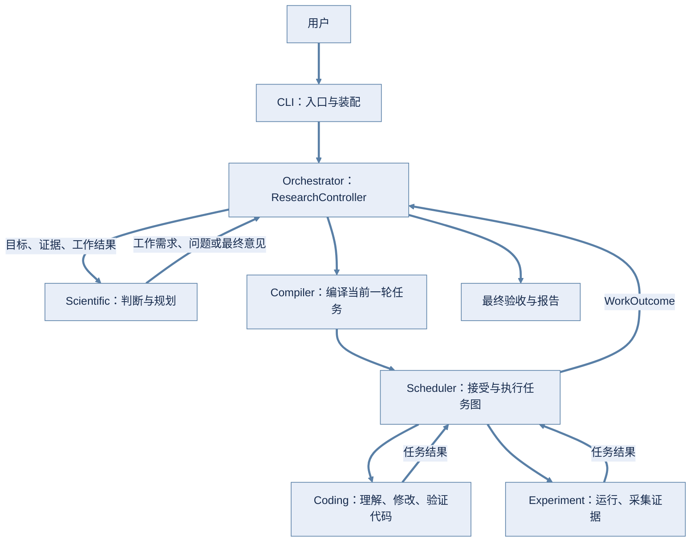
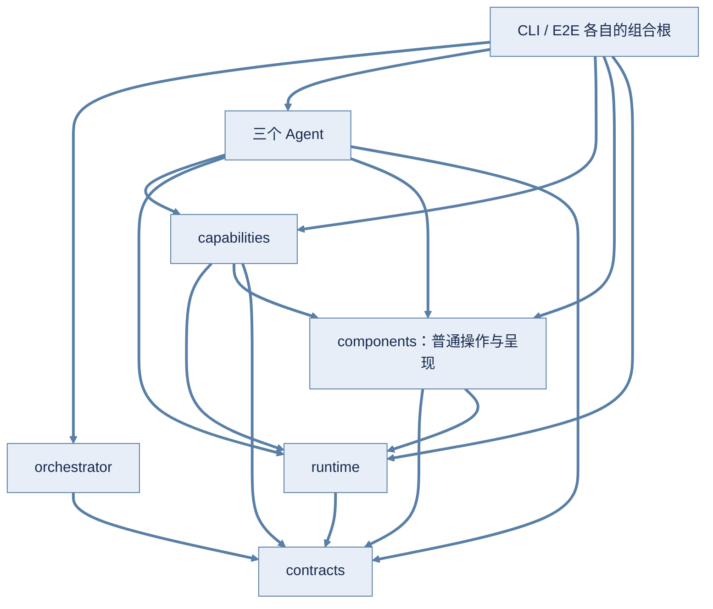

# 当前架构

这份文档回答：**系统由哪些部分组成，各管什么，谁可以调用谁。** 方法、字段和失败约定集中在 [模块接口与契约](CONTRACTS.md)；字段怎样进入模型输入见 [上下文说明](CONTEXT.md)。第一次了解项目可先读 [理解一次研究任务](../guides/UNDERSTANDING.md)。

只描述当前实现，不把历史计划或未来设想画成已有模块。当前公共数据 schema 为 **11.0**；旧记录的解析与恢复边界见 [版本规则](CONTRACTS.md#schema)。

## 1. 总体结构

ResAgent2 是整个项目的名字，**Orchestrator 只是其中的研究编排模块**。Scientific 负责科学判断，Orchestrator 负责把判断转成受控执行，Coding 和 Experiment 完成专业工作。

<!-- 两张图共用深浅主题通用配色：中等明度蓝色连线/箭头/边框，深色文字配固定浅底；不依赖预览插件切换主题。 -->

Compiler 和 Scheduler 位于 orchestrator 包内，不是额外 Agent。箭头表示业务数据流；具体调用由 Controller 协调。三个 Agent 内部共享 runtime、components 与 capabilities。

执行入口保持统一：三个执行 Agent 都接收一条自然语言 `instruction`，其余入口字段用于身份、预算、工作区、Session、资源、答案和结果控制。只有 Experiment 额外接收 `TaskAcceptanceSpec` 与 `confirm_before_experiment`；这些是确定性控制，不塞进自然语言。Compiler 的内部 Workflow 图仍可使用 typed `goal`、`inputs` 和 `constraints`，由 Scheduler 在执行边界转换成 instruction 和控制字段。

## 2. 模块边界

| 模块 | 它的工作 | 它不做什么 | 代码 / 接口 |
|---|---|---|---|
| `apps/cli` | 命令、交互监看、配置；装配 Controller、Agent 和资源 | 不自己调度 Task 或修改 Run 状态 | [composition.py](../../apps/cli/src/resagent2_cli/composition.py) / [用户入口](CONTRACTS.md#entry) |
| `orchestrator` | Run 入口；编译、调度、预算、恢复、工件登记、最终验收 | 不直接改代码、跑实验或形成科学观点 | [包入口](../../packages/orchestrator/src/resagent2_orchestrator/) / [科学](CONTRACTS.md#scientific)、[编译](CONTRACTS.md#compiler)、[执行](CONTRACTS.md#module) |
| `agents/scientific` | 阅读证据、检索文献、提出工作需求或最终观点 | 不生成任务图，不选执行环境，不直接调用其他 Agent | [agent.py](../../packages/agents/scientific/src/resagent2_scientific/agent.py) / [ScientificPort](CONTRACTS.md#scientific) |
| `agents/coding` | 理解代码；或修改后验证，交付真实变更 | 不承担正式训练对比和科学结论 | [agent.py](../../packages/agents/coding/src/resagent2_coding/agent.py) / [ModulePort](CONTRACTS.md#module) |
| `agents/experiment` | 准备环境、运行实验、从本次真实证据派生指标 | 不修改产品代码，不用 LLM 自报值代替指标 | [agent.py](../../packages/agents/experiment/src/resagent2_experiment/agent.py) / [ModulePort](CONTRACTS.md#module) |
| `runtime` | AgentLoop、LLM、上下文、Tool 协议、反馈、Session、权限与完成检查的调用机制 | 不理解科研目标，不调度 Workflow，不实现具体文件/环境能力 | [包入口](../../packages/runtime/src/resagent2_runtime/) / [工具与运行](CONTRACTS.md#tools) |
| `components` | 工作区、Git、进程、环境、数据集、工件、文献后端与共享内容投影，供普通 Python 调用 | 不提供 Tool 入口，不启动 Loop，不决定领域流程 | [组件目录](../../packages/components/README.md) / [调用约定](CONTRACTS.md#components) |
| `capabilities` | 模型可调用的工作区、工件、环境、文献 Tool，以及输入 schema 和局部工具逻辑 | 不作为普通组件的转发入口，不存放 Agent 工作流策略 | [工具目录](../../packages/capabilities/README.md) / [工具协议](CONTRACTS.md#tools) |
| `contracts` | 跨模块数据类型、字段和纯组合判据 | 不执行 LLM、IO 或状态迁移 | [models.py](../../packages/contracts/src/resagent2_contracts/models.py) / [字段参考](CONTRACTS.md) |

### 依赖倒置与组合根

这是按职责划分的依赖图，**不是必须逐层调用的流水线**。Capabilities 按需使用 Components 和 Runtime；一个 Tool 可以使用多个组件，也可以直接实现简单操作。Agent 的准备、完成检查和组合根可以直接调用 Components。Components 中的共享投影使用 Runtime 的类型和选择函数，底层操作只引入实际需要的依赖。箭头指向被依赖者。

Orchestrator 通过 ScientificPort / ModulePort 调用注入的实现，不 import 具体 Agent；外层组合根负责接线。Port 是进程内 Python 调用约定，不是网络服务，也不自动提供隔离或幂等。

Runtime 不 import Components 或 Capabilities；Components 不 import Capabilities、Agent 或 Orchestrator；Capabilities 不 import Agent 或 Orchestrator。组件与 Tool **没有一一对应关系**，不建立注册器、适配器基类或自动映射。

Capabilities 的四个目录是 `workspace/`、`artifacts/`、`environment/`、`literature/`，每组在 `__init__.py` 放 Tool 实现。Components 按实际复杂度组织：多数操作一个文件；文献后端及其共用 HTTP 实现在 `literature/`；小函数跟随使用它们的实现。目录示例不是“每类都必须拆文件”的规则。

`run_verification` 的命令规则、编辑 revision 和验证记录属于 Coding，放在 [verification.py](../../packages/agents/coding/src/resagent2_coding/verification.py)，与 Experiment 自有 `run_command` 对称；二者共用 Components 的 ProcessRunner。Runtime 自有 finish/ask_user 和 Scientific 的控制工具仍留在原模块，不为统一目录搬走领域控制。

CLI 是产品入口；[real_e2e.py](../../e2e/real_e2e.py) 是独立验收装配。两者共享 PromptLLMClient 和 ScientificArtifactRegistration 等机制，但保留各自配置与测试目标，不合成隐藏的全局 bootstrap。

## 3. 一次工作如何往返

1. **创建 Run**：入口提供 ResearchRequest 与授权工作区，不预填资源。Controller 保存目标和导入工件，从部署目录发现数据集引用并保存到 Run，再启动科学回合；后续推进及回答恢复时可发现新登记。
2. **提出需求**：Scientific 自己检索、读证据、判断；需要执行工作时返回 WorkRequestDraft，只表达目标、期望证据和约束。
3. **编译当前一轮**：LLM 产生语义草图；代码分配身份、解析依赖和工作区，校验后做有界 review。结构与语义拒绝共用一次纠错，最多两版草图；review 不保证自然语言需求一定完整。
4. **接受并执行图**：Scheduler 校验候选图、绑定、预算和 revision 后接受；只执行依赖成功的 ready Task。已知代码前置条件先交 Coding，正式实验交 Experiment。
5. **收集结果**：模块返回 ModuleResult。Scheduler 验收响应、记录 Attempt、登记工件，再构建 WorkOutcome 交回 Controller。
6. **解释与下一步**：Scientific 的 [interpreter.py](../../packages/agents/scientific/src/resagent2_scientific/interpreter.py) 把结果投影成工作简报；Scientific 读证据后决定继续、询问用户或完成。
7. **正式完成**：Scientific 完成提议通过 Orchestrator 最终 gate 后，登记报告，再将 Run 标为 completed。

interpreter 属于 Scientific，因为它负责“Scientific 应怎样理解执行结果”，不改变执行事实。它无 LLM、无 IO、无状态，不是新服务。stderr 摘录只作执行诊断，summary 是解释性文字，科学证据仍须通过授权工件读取。

代码理解的答案、不确定性和来源路径，以及修改/实验结果中非空的残余风险，通过 `kind=module_report` 的冻结 Markdown 工件交接。三个完成检查复用 components 的 `build_module_report` 纯函数生成带字段标题的可读投影；长物理行按 1000 字符分行，便于既有 read_artifact 按行读取后部内容，不删解释内容。展示换行不承诺与原 payload 字节相同，原 payload 的精确原文保持不变；不另调 LLM、不把整个 payload 倒给 Scientific。报告经既有 Registry、依赖工件授权和读取机制交接；interpreter 标明其用途是模块解释，不能当成独立测量证据。

### 三个循环，不要混在一起

| 层次 | 工作 | 何时交回控制 |
|---|---|---|
| Controller 科学控制循环 | 科学判断 → 工作请求 → 执行结果 → 再判断 | 完成、失败或等待用户 |
| Scheduler 任务执行循环 | 选择 ready Task，处理 Attempt 和 retry | 本轮图稳定或需暂停 |
| 每个 Agent 的 AgentLoop | 上下文 → 候选动作 → 工具 → 观测 → 完成检查 | 模块结束、请求工作或问用户 |

Compiler 不是第四个 AgentLoop：它调用 LLM，但没有 Session 或工具循环；经 PromptLLMClient 复用上下文预算即可。

Compiler 的生成与评审共用一份能力职责和字段语义说明。此 LLM 编译路径故意不填具体指标键、产物路径和代码路径；执行 Agent 负责发现细节，证据要求仍须在任务的目标、instructions 和约束中明确。评审不能仅因这些字段为空就拒绝，也不能因此放过真正缺少的要求。

depends_on 要求上游成功，不能表示“失败时修复”。真实失败先返回 Scientific；需要修复时新发 WorkRequest，追加 fix → rerun 的任务。

## 4. 状态由谁管

| 对象 | 含义 | 职责归属 |
|---|---|---|
| Run / WorkRequest | 整个研究过程 / 其中一轮工作需求 | Controller |
| Workflow / Task / Attempt | 已接受任务图 / 任务 / 一次执行尝试 | Scheduler |
| Session / events / memory / tool_turns | Agent 内部执行记录与原生工具协议续传 | Agent 与 runtime |
| ArtifactRef 与冻结内容 | 有来源和 hash 的证据引用及文件 | Registry 登记；Controller/Scheduler 收入 Run |

Task 可有多个 Attempt；**问答续跑不是 retry**：回答后继续同一 Attempt、Session、输出目录和基线。retry 才开始新 Attempt；新一轮科学修复则是新 WorkRequest 和新任务。

保存答案和让模型看见答案是两个步骤：用户提交 UserAnswer，Controller 从当前 PendingQuestion 取原题、生成 RecordedAnswer 保存，调用方不能提供或替换原题。Scheduler 只传递本 Task 的已配对回答；Coding/Experiment 的 context builder 经共享 `user_answers_section` 放入 required `answers` 段，由原有 ContextComposer 计量，每一步都可见。它不另存状态，也不主动删除本 Task 的早期回答；Scientific 保持自己的既有答案投影，同样收到 question_text 与 values。成功发出 ask_user 不等于前提已满足，资源仍按恢复后的实际目录视图判断。

Scientific Session 属于 Run，跨工作回合复用；Coding/Experiment Session 属于 Run + Task + Attempt。上层保存 SessionRef，不读 Agent 私有 memory 驱动调度。

Controller 是唯一 Run 业务入口：create_run 创建后会执行到稳定状态，不只是插入记录；answer_question 保存答案再续跑；run_until_stable 不制造答案，也不绕过 paused。

### 恢复保证的范围

- 派发前保存运行意图。重启按已有规则保留/结算中断记录，再决定恢复或重试，不把遗留 running 当成功。
- Session 创建时固定工具协议身份：正文 JSON 为 `None`，OpenAI-compatible 原生身份由协议、endpoint、model 构成且不含 API key；自定义原生客户端须提供稳定身份。恢复拒绝 JSON↔原生切换和原生 endpoint/model 变化，不做迁移。
- 原生 AgentLoop 先保存整批 call，逐项派发前记录 executing_call_id，结果按 call ID 配对。重启保留已完成回执；正在执行但缺回执的项记为 unknown outcome，后续项记为未开始；不自动重放。这只提供进程重启 checkpoint，不保证掉电持久化，也不承诺外部副作用 exactly-once。
- 已接受图优先恢复；未接受编译可重做，但 LLM 不保证每次选择相同任务。
- 原生 Scientific 按工作请求或问题身份去重交付；不能推广成所有 Port/工具的自动幂等。
- 单个 JSON 快照可原子替换，但 Run、Session、文件和命令不构成一个大事务。当前以单进程、单写入者为前提，不支持同一 Run 并发推进。
- 中断不保证外部命令没发生；失败不自动回滚代码、依赖或全部文件。CLI 停止监看也不等于取消执行。

返回分支和状态映射见 [执行任务](CONTRACTS.md#module) 与 [状态参考](CONTRACTS.md#states)。

## 5. 结果、证据与完成

ArtifactCandidate 是生产方提出的文件；Registry 校验授权和来源、冻结内容并计算 hash 后，才产生 ArtifactRef。授权可以读不等于已经读，已经读过也不保证正文一直留在模型上下文。

执行 Agent 负责生成候选证据，Scheduler 接收 ModuleResult 后调用 Registry 完成登记冻结。单独调用 NativeExperimentAgent 并看到 metrics.json，不等于已走完这条登记链路。

Experiment metrics 从完整的真实 JSON 证据集派生，summary 只是模块提供的解释。指标是便于机器使用的证据投影，**不是比原始工件更高一级的真相**。矛盾需回查工件；执行成功也不证明假设成立。

`module_report` 不改变原完成门槛：code_understand 仍须引用实际观察过的代码文件；code_modify 仍须真实改动与有效验证；experiment_run 仍须成功命令及本 Attempt 的真实证据。报告在这些检查之后追加，不加入 metrics 推导，也不能用它补齐缺少的实验文件。代码理解成功总有报告；修改/实验只在 residual_risks 非空时增加报告，没有风险时不增加一份空说明。

两级完成检查职责不同：

- Agent completion check 核对本次变更与有效验证、实验命令和证据，或 Scientific 的已读引用等领域事实。
- Run 最终 gate 从完整 Run 核对任务、证据归属、观察集合、观点与局限；失败任务身份由代码写入报告，不要求 Scientific 回传 Task ID。

inconclusive 可以是合法完成的科学意见；completed_with_warnings 必须保留缺口。字段合法、工具成功、Run 完成和科学结论正确不能互相替代。

## 6. 共享能力与上下文

各 Agent 与 Compiler 的逐段构成、刷新时机、必需/可选选择及多层预算，统一查 [模型上下文](CONTEXT.md#modules)。本节只说明架构归属，不重复维护完整段表。

资源需求不必在启动时声明。ResearchRequest 不含数据集/缓存配置；部署 catalog → Controller 的 Run 引用 → Agent 的实际可用性检查。缺所需资源复用 ask_user，不增资源状态机。Controller/Scheduler 共用 Run 剩余时间计算，只扣除显式人工等待，不重置调用预算。

Components 是普通 Python 对象/函数，Capabilities 是模型 Tool；两者不要求每项配一个 Agent、Session 或管理器。只服务单个 Tool 的小逻辑可留在 Tool 内；业务策略留在所属 Agent，不一概塞进“共用”目录。

- WorkspaceBoundary 管文件访问范围；WorkspaceObserver 在 Git 下用 Attempt baseline，非 Git 下用有界文件 hash 观察变化。
- ProcessRunner 运行命令并保存输出；EnvironmentManager 与共享 Tool 管基础环境和认证。环境按 Run + workspace 绑定；重新绑定或开始 prepare/setup 会使旧认证/验证过期。
- DatasetCatalog 读取部署登记表，Controller 持有 Run 内已知引用。共享 resolve_dataset_refs 区分登记与实际目录可用性；三个 Agent 的上下文和脚本映射使用同次检查结果。缺少不相关数据不阻塞；需要的数据缺失时通过已有 ask_user 请求用户准备，恢复时重新检查，不擅自下载。
- RegisteredArtifactReader 先核对 Run 授权和整份 hash，再按行切片；文件读取复用相同切片逻辑。
- Runtime先确定模块/模型有效输入额度，再由builder声明固定段与可伸缩材料，Composer统一计量和分配。三个Agent与Compiler共用128000的默认输入额度，Compiler仍为无状态JSON编译/审查，不使用Session压缩；workspace_context共用文件/工件/诊断/目录投影，先分起始份额、空余按优先级借用，材料扩展至整包80%软水位，真正超限仍报错，不另建缓存或恢复状态机。旧观察带时序和后续内置修改标记，不冒充最新磁盘全文。文献以每篇论文一个条目的检索摘要工件呈现，不新增阅读笔记。详见[材料与预算](CONTEXT.md#budgets)。
- 文献来源由 CLI/E2E 组合根装配：arXiv、OpenAlex 平级，互为备份；继续使用最近成功来源，不可用时试其他源，每次最多遍历一轮。复用 LiteratureSearchBackend 与同一套 HTTP 节奏/冷却，不改变 Scientific、工件格式或上下文；详见[文献组件](../../packages/components/README.md#literature)。

Agent 选择 ContextSection，Runtime 统一加入工具协议、反馈和历史，再由 Composer 计量。OpenAICompatibleClient 的 AgentLoop 使用原生 `tools`，每项 schema 直接来自既有 `Tool.input_model`；没有原生能力的测试/注入客户端仍可走 `next_action` 正文 JSON 和简短 `tool_contracts`。Session 的 `tool_protocol_key` 固定调用协议与原生配置身份，恢复不能降级或换 endpoint/model。模块输入上限与注入的 ModelProfile 共同限制容量；必需段装不下明确失败。**不根据模型名字猜容量，不自动扩容。**

最小 LLM client 仍只须 `next_action`；AgentLoop 会探测可选的 `next_tool_call`。OpenAICompatibleClient 同时提供两条路径：AgentLoop 用原生工具调用，Compiler 经 PromptLLMClient 继续用正文 JSON；两者不互相降级。计量、预算和 trace hooks 仍可选，内部有重试的客户端应提供真实计量。细节见 [Runtime 参考](CONTRACTS.md#tools)；部署参数集中在 [CLI README](../../apps/cli/README.md#6-模型与上下文预算)。

正文 JSON 路径的模型正文不是合法 JSON，或原生路径的 tool arguments 不是 JSON object 时，客户端不原样重发同一请求。AgentLoop 把简短原因送入已有的 required `runtime_feedback`，在同一 Session/Attempt 内允许有限纠正；原生每轮接受 1–8 个 tool calls，整批参数/权限预检后串行执行并逐项保存回执；控制工具独占一轮，失败取消剩余调用，assistant content 不是备用指令。Compiler 使用已有的两版 draft 上限处理正文 JSON 错误，不引入 AgentLoop。网络及响应封装故障仍走客户端原有有界重试。

原生 Session 的 `tool_turns` 保存已配对 assistant/tool 消息；下一轮只重建最新业务 Context 并与这段协议历史一起发送，不累积旧 prompt。输入压力下只总结较早完整回合，原始历史不删；检查点、近期原生回合和当前领域上下文共同构成输入，详见[最小压缩](CONTEXT.md#compaction)。完整 `messages + tools`（含 JSON 转义）与业务 Context 共用 128K 总输入额度，摘要和动作/重试共用 Run 剩余调用预算；step 只记录时序，不再限制。`reasoning_content` 只用于同 Session 协议续传，不是业务证据。

## 7. 开发时保持的边界

1. 自然语言表达意图；身份、状态、权限、预算和证据记录由代码控制。不解析 summary 推断机器状态。
2. 一个事实只有一个权威来源：Task 约束来自已编译 Task，数据集登记来自部署 catalog、Run 保存已知引用，可用性来自实际检查，物理授权来自 WorkspaceGrant，当前环境来自实际 binding。
3. 调用方只依赖公开输入输出和行为约定，不读下游私有 Session 或猜内部步骤。
4. 同一行为保留一条生产主线。已有共享能力优先复用；至少两个语义一致的消费者才考虑新抽象，不为“将来可能开放”先造框架。
5. 接收方校验响应，领域 finalizer 校验执行事实。可共享纯判据，不把不同边界检查硬合成一层。
6. 字段变更同时核对生产者、消费者、失败/恢复和测试；破坏性改变升级 schema，旧记录原样保留，不引入无需要的兼容运行路径。

## 8. 当前没有承诺的能力

没有通用 MCP/A2A 服务、动态插件市场、分布式调度或通用逐轮聊天控制。Port 是替换位置，不代表这些功能已实现。

权限与 shell-free 执行不是 OS 沙箱；环境 audit 不是安全认证。预算检查不抢占正在运行的工具；没有全 Run 货币/总输出 token 硬预算。Session 目录/文件固定为 `0700/0600`，不受 trace 档位影响；full trace 还可能含源码、用户输入、`raw_tool_calls` 和 `raw_reasoning_text`，只用于受控调试，不自动成为科学证据。metadata 仅留 hash，不表示 Session 不保存原生协议续传字段。

历史取舍和验收见 [决策与历史](../history/README.md)。这些限制不是本轮文档调整新增的功能或降级。
