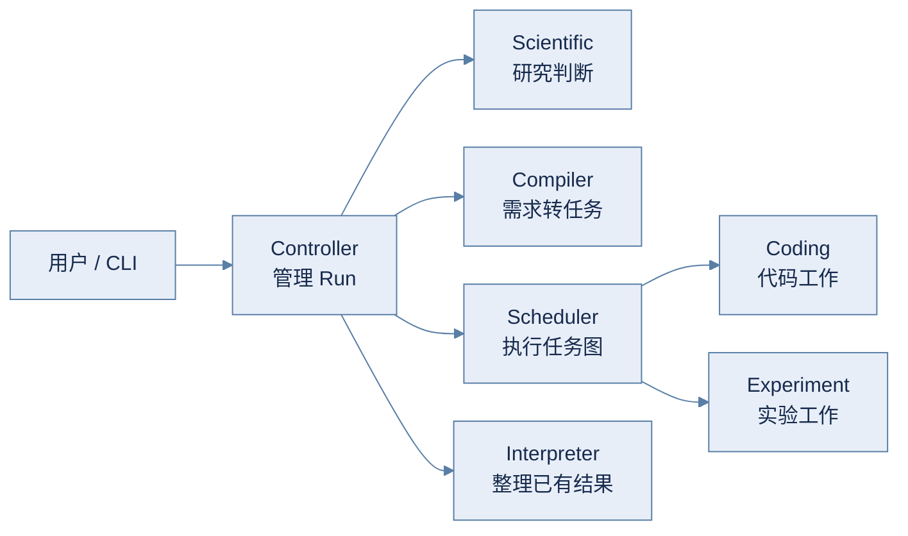
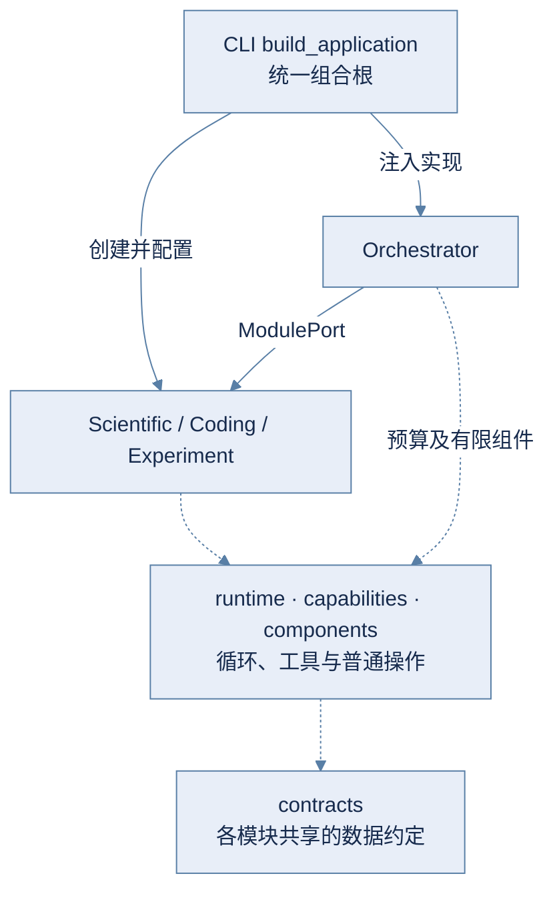

# 当前架构

ResAgent2 把一次研究任务分成三件事：**Scientific 判断需要什么证据，Orchestrator 把执行工作组织起来，Coding 和 Experiment 完成专业工作。** 三个 Agent 都使用 LLM，但研究目标、任务状态、工具执行和证据登记分别有明确的负责人。

本页先说明这些角色，再沿一次研究任务走完整条交接链，最后解释模块如何装配、状态和材料放在哪里。字段及校验规则见 [模块接口与契约](CONTRACTS.md)，模型具体看到什么见 [上下文说明](CONTEXT.md)，修改时应保持什么见 [设计原则](DESIGN_PRINCIPLES.md)。这些文档只描述当前代码；公共 schema 为 **24.0**，旧 Run/Session 不迁移、不兼容恢复。

## 1. 总体结构

先区分几个名字，后面的流程就容易理解：

| 名字 | 含义 | 一个例子 |
| --- | --- | --- |
| Run | 用户发起的整个研究过程 | 研究某种校准方法是否有效 |
| WorkRequest | Scientific 提出的某一轮执行需求 | 实现方法并完成对照实验 |
| Workflow / Task | 已接受的任务图 / 图中的一项工作 | 先实现代码，再运行实验 |
| Attempt | 一个 Task 的一次尝试；失败重试才创建下一次 | 实验首次失败，第二次重试 |
| Session | 一个 Agent 的工具循环记录和续跑身份 | Coding 暂停问用户，回答后继续原会话 |
| Artifact | 已登记、冻结、可交接和追溯的文件或结构记录 | 论文、代码 patch、实验结果、工作反馈 |

ResAgent2 是整个项目；**Orchestrator 是其中的研究编排包，不是第四个 Agent**。它包含 Controller、Compiler、Scheduler、Interpreter，以及状态、工件和验收实现。

下面回答“谁调用谁来完成研究”。实线表示主要调用方向；返回的公共结果沿相反方向交回，不另画一套返回箭头。

```mermaid
%%{init: {"theme": "base", "themeVariables": {"primaryColor": "#e8eef8", "primaryTextColor": "#172b4d", "primaryBorderColor": "#597fa6", "lineColor": "#597fa6", "textColor": "#172b4d", "edgeLabelBackground": "#ffffff"}, "flowchart": {"nodeSpacing": 30, "rankSpacing": 45}}}%%
flowchart LR
    Entry[用户 / CLI] --> Controller[Controller<br/>管理 Run]
    Controller --> Scientific[Scientific<br/>研究判断]
    Controller --> Compiler[Compiler<br/>需求转任务]
    Controller --> Scheduler[Scheduler<br/>执行任务图]
    Controller --> Interpreter[Interpreter<br/>整理已有结果]
    Scheduler --> Coding[Coding<br/>代码工作]
    Scheduler --> Experiment[Experiment<br/>实验工作]
```

Scientific 依据用户目标选择下一步：可以直接搜索、抓取或读取材料，也可以用 `request_work` 委托执行工作、用 `ask_user` 请求补充、或提交最终意见。系统没有固定“搜索网页 → 查论文 → 取全文 → 跑实验”的顺序。Coding 和 Experiment 也在各自职责、授权和预算内自主选择工具步骤。

Compiler 使用 LLM 把执行需求翻译为任务草图；Scheduler 用代码接受并执行任务图；Interpreter 用固定代码组织已经记录的结果。它们没有独立的 AgentLoop 或 Session，也不代替 Scientific 作科学结论。

## 2. 一次工作如何往返

这条链从用户需求开始，最终回到 Scientific 的判断；只有需要执行工作时才进入 Compiler 和 Scheduler。

1. **建立研究过程。** CLI 装配模块，将 `ResearchRequest` 和工作区交给 Controller。Controller 创建 Run、保存授权和预算、登记用户输入及导入论文，并发现部署目录中的数据集引用。
2. **研究与取材。** Controller 调用 Scientific。Scientific 按需使用文献、网页和工件工具；读取结果进入它的工具回执与后续上下文。发现执行需求时返回 `WorkRequestDraft`，表达目标、约束和期望证据。
3. **翻译执行需求。** Controller 调用 Compiler。LLM 生成任务草图，代码分配身份、解析依赖和工作区并校验结构；解析或结构错误最多纠正一次，不另做语义复审。
4. **执行任务。** Scheduler 接受任务图，只派发依赖已成功的 ready Task。任务以 `AgentRequest` 交给 Coding 或 Experiment；专业 Agent 在内部工具循环中执行，返回 `AgentResult`。
5. **接收真实交付。** Scheduler 保存报告和 Attempt，调用 Registry 校验并冻结候选工件，按冻结要求验收。下游任务通过显式 `output_name` 绑定上游成功 Attempt 的唯一工件。本轮任务稳定后返回 `WorkOutcome`。
6. **把结果交回研究判断。** Controller 冻结包含原需求、执行事实和尝试记录的 `work_record`，调用 Interpreter 整理已记录报告，保存 `work_feedback` 和累计科研目录。Scientific 在原 Session 收到这轮反馈，按目录读取原件，再决定继续工作、提问或完成。
7. **关闭 Run。** Scientific 提交 `scientific_opinion`。Controller 通过最终 gate 校验实际任务和交付，生成最终报告，才将 Run 记为 completed。

所有 Agent 共用一种业务接口：`invoke(AgentRequest) → AgentResult`。需求主要是 `instruction + input_artifacts`，交付主要是 `report + artifacts`；身份、权限、预算、工作区和恢复由控制字段表达。`request_work` 是 Scientific 的普通工具调用；它返回执行需求后，由 Controller 接管跨 Agent 的过程，Scientific 不直接调用另一个 Agent。

Compiler 按职责路由：实现代码和正确性验证交 Coding；为回答研究问题而进行的训练、拟合、评估和测量交 Experiment。同一 Agent 的准备、检查与执行尽量留在一个任务内。`depends_on` 表示上游成功，不表示失败修复；需要新的修复工作时，由 Scientific 提出新 WorkRequest，而不是在依赖图里隐藏第二套控制流程。

### 三个循环，不要混在一起

| 循环 | 它推进什么 | 何时交回控制 |
| --- | --- | --- |
| Controller | 科学回合、工作需求、反馈和用户问答 | Run 完成、失败或等待用户 |
| Scheduler | ready Task、Attempt 和允许的 retry | 本轮任务图稳定或需要暂停 |
| AgentLoop | 构造上下文、模型动作、工具回执和完成检查 | Agent 结束、请求工作或问用户 |

三个 Agent 共用同一个 AgentLoop 实现，差别由身份 prompt、工具列表、上下文 builder、权限策略和完成检查注入。Compiler 是无状态的模型调用，Interpreter 是固定结果整理，两者不增加第四、第五套工具循环。

## 3. 模块边界

| 模块 | 负责的事情 | 不负责的事情 | 代码入口 |
| --- | --- | --- | --- |
| `apps/cli` | 用户命令、配置、问答与监看；选择并装配实现 | 调度 Task、改写 Run 状态 | [composition.py](../../apps/cli/src/resagent2_cli/composition.py) |
| `orchestrator` | Run 控制、需求编译、任务调度、结果整理、工件登记和最终验收 | 直接改代码、跑实验、形成科学意见 | [controller.py](../../packages/orchestrator/src/resagent2_orchestrator/controller.py)、[scheduler.py](../../packages/orchestrator/src/resagent2_orchestrator/scheduler.py) |
| `agents/scientific` | 按研究目标取材、读证据、提出执行需求和科学意见 | 生成任务图、直接调用其他 Agent | [agent.py](../../packages/agents/scientific/src/resagent2_scientific/agent.py) |
| `agents/coding` | 理解或修改代码、验证正确性、交付实际变更 | 承担正式研究测量和科学结论 | [agent.py](../../packages/agents/coding/src/resagent2_coding/agent.py) |
| `agents/experiment` | 解读已有结果、准备环境、执行实验、交付原始证据 | 修改产品代码、用自报数值代替测量 | [agent.py](../../packages/agents/experiment/src/resagent2_experiment/agent.py) |
| `runtime` | 通用 AgentLoop、模型客户端、工具协议、Session、上下文和预算机制 | 研究规划、Workflow 调度、具体文件/环境操作 | [包入口](../../packages/runtime/src/resagent2_runtime/) |
| `capabilities` | 模型 Tool、输入 schema、局部工具逻辑与操作权限适配 | 普通组件的转发出口、Agent 工作策略 | [工具目录](../../packages/capabilities/README.md) |
| `components` | 普通 Python 操作与共享呈现：工作区、Git、进程、环境、数据集、工件、文献和网页 | 启动工具循环、决定领域流程 | [组件目录](../../packages/components/README.md) |
| `contracts` | 公共请求、结果、身份和记录类型，以及纯组合判据 | LLM、IO、运行状态迁移 | [models.py](../../packages/contracts/src/resagent2_contracts/models.py) |

### 依赖倒置与组合根

第二张图回答“入口如何把模块接起来”，**不是完整 import 图，也不是强制逐层调用的流水线**。实线表示装配或调用接口，虚线表示使用共享机制。这里把共享包放在一起，是为了表达职责关系，不表示这些包可以任意互相依赖。

```mermaid
%%{init: {"theme": "base", "themeVariables": {"primaryColor": "#e8eef8", "primaryTextColor": "#172b4d", "primaryBorderColor": "#597fa6", "lineColor": "#597fa6", "textColor": "#172b4d", "edgeLabelBackground": "#ffffff"}, "flowchart": {"nodeSpacing": 35, "rankSpacing": 55}}}%%
flowchart TB
    Root[CLI build_application<br/>统一组合根] -->|注入实现| Orch[Orchestrator]
    Root -->|创建并配置| Agents[Scientific / Coding / Experiment]
    Orch -->|ModulePort| Agents
    Agents -.-> Shared[runtime · capabilities · components<br/>循环、工具与普通操作]
    Orch -.->|预算及有限组件| Shared
    Shared -.-> Contracts[contracts<br/>各模块共享的数据约定]
```

CLI 的 `build_application` 是产品组合根，创建模型客户端、状态存储、Agent、资源与供应商后端，并注入 Controller/Scheduler。`real_e2e.py` 复用这一装配入口，只组织场景输入和验收断言：完整研究场景调用 Controller，Coding / Experiment 定向场景调用已装配的 Agent binding；不再另建模型、上下文或联网配置。Orchestrator 调用 Agent 时只使用 `ModulePort` 的公共接口，不 import 某个 Agent 的具体实现。Port 是进程内 Python 调用约定，不是网络服务，也不自动提供隔离或幂等。`contracts` 是各模块共同依赖的数据约定；图中只画一个入口，避免把所有公共类型依赖连成交叉箭头。

图中省略的精确项目依赖如下；标准库和第三方库不列在这里：

| 使用者 | 允许的项目依赖 | 必须保持的边界 |
| --- | --- | --- |
| `contracts` | 无其他项目包 | 公共数据层不执行业务 |
| `runtime` | `contracts` | 不反向 import Components、Capabilities、Agent 或 Orchestrator |
| `components` | `contracts`；实际需要的 `runtime` 类型、HTTP、模型请求、预算和投影 helper | 不 import Capabilities、Agent、Orchestrator 或 CLI |
| `capabilities` | `contracts`、`runtime`、`components` | 不 import Agent 或 Orchestrator |
| 三个 Agent | `contracts`、`runtime`、`components`、`capabilities` | 不直接 import、调用其他 Agent |
| `orchestrator` | `contracts`；`runtime.budget`；`components.workspace/artifacts/materials/literature` | 不 import 具体 Agent 或模型 Tool |
| CLI 组合根 / E2E 场景入口 | CLI 装配所需各包，真实 E2E 复用已装配应用 | 具体行为仍调用拥有者接口；mock 保留确定性测试替身 |

Components 可以直接被 Agent 的准备/完成步骤或组合根调用，不要求先经过 Tool；其共享内容投影可以使用 Runtime。Capabilities 与 Components 没有一一对应关系，不建立逐项配对的类或自动映射。通用 `run_shell`、安装和 Coding 的领域 `run_verification` 共用 ProcessRunner，但专业验证规则仍留在 Coding。

Runtime 的 `finish/ask_user` 和 Scientific 的控制工具留在职责所属模块；不是所有 Tool 都必须搬进 Capabilities。具体 import 约束由 [包边界测试](../../tests/README.md)验证，扩展时的原则见 [设计原则](DESIGN_PRINCIPLES.md)。

## 4. 状态由谁管

| 状态或记录 | 权威来源与负责人 |
| --- | --- |
| Run、WorkRequest、问题与科学回合 | Controller；持久化在 RunStore |
| Workflow、Task、Attempt、接收交付 | Scheduler；与 Run 一起保存 |
| Session、events、memory、tool_turns | Agent 与 Runtime；持久化在 SessionStore |
| 工件身份、来源、hash 和冻结文件 | Registry 在登记边界生成 ArtifactRef；`Run.artifacts` 保存登记结果 |
| 科研目录和每轮工作反馈 | Controller 保存引用；目录由登记及执行事实重建，Interpreter 整理报告 |
| 模型请求用量、剩余执行时间 | Run 保存总账；Runtime 将余额与截止时间传给内部调用 |

Scientific Session 属于整个 Run，跨工作回合复用；Coding/Experiment Session 属于 `Run + Task + Attempt`。上层保存 SessionRef，通过公共结果协作，不读 Agent 的私有 memory 来驱动调度。

**问答续跑不是 retry。** Controller 根据当前 PendingQuestion 生成包含原题的 RecordedAnswer，冻结为 answer 工件。恢复指向这次回答，并在任务需求部分呈现当前作用域的问答。回答继续原 Attempt、Session、输出目录和基线；失败重试才创建新 Attempt 和 Session。新的尝试不自动继承旧尝试的问答，缺少必要条件时重新询问；旧回答和尝试历史仍持久保存。批准同样绑定准确动作及作用域，不会因为读到 answer 就自动获得授权。

Controller 是 Run 的业务入口：`create_run` 创建后推进到稳定状态，`answer_question` 保存回答再续跑，`run_until_stable` 不伪造答案或绕过 paused。外部论文可在创建时导入，或仅在 paused 时追加并刷新目录；导入不答题、不恢复、不重置预算，也不创建独立论文库。

### 恢复保证的范围

运行前保存意图，返回后保存结果；恢复优先继续已接受的任务图、已登记材料和原 Session。原生工具批次保留已完成回执，结果未知的在执行调用记为 unknown，不自动重放。已保存的工作反馈按 WorkRequest 复用，原始历史和既有消耗不重置。

这些是进程重启的检查点保证：当前按单进程、单写入者推进 Run，Run/Session/文件/命令不构成一个大事务，不承诺外部副作用恰好执行一次。Session 固定 schema 和协议身份，恢复拒绝切换 JSON/原生协议或原生 endpoint/model。完整状态映射与恢复边界见 [状态与身份](CONTRACTS.md#states)、[上下文恢复与压缩](CONTEXT.md#compaction)。

## 5. 结果、证据与完成

工具回执、文件、已登记工件和科学证据是不同概念。一次读取可以只返回正文片段；一个文件也可能尚未登记。生产方提交 `ArtifactCandidate` 后，Registry 校验来源和授权、冻结内容并计算 hash，才成为可交接的 `ArtifactRef`。Coding/Experiment 的交付由 Scheduler 接收后登记；Scientific 的搜索和抓取工具通过注入的登记接口即时登记。

`Run.artifacts` 是登记结果的权威记录。`research_index` 是从已授权工件、工作目标和尝试记录生成的累计导航，按初始材料、Scientific 材料和 WorkRequest 分组；它不扫描未登记文件，不递归收入自身、反馈或观察日志。`artifact_index` 是每个 Agent 看到的完整授权目录投影，正文仍通过读取工具获取。目录没有独立权限，不代替原件或协议历史。

工作反馈把原需求与执行结果配对：`work_record` 保存工作需求、任务结果和尝试事实；`work_feedback` 保存按任务整理的报告及目录引用。长解释可以作为 `module_report` 工件显式读取。报告是专业解释，原始测量来自结果文件；失败尝试、警告和局限不会被后续成功覆盖。访问日志只说明返回过哪些内容，不自动决定引用资格或科学结论。

完成有三个职责边界，而非三套相互竞争的真相：

| 检查位置 | 核对的事实 |
| --- | --- |
| Agent CompletionCheck | 本次领域执行和候选交付是否满足要求；不通过则沿原 Loop 返回纠正反馈 |
| Scheduler / Registry 接收 | 来源、授权、实际冻结内容和 Task 的明确验收要求 |
| Controller 最终 gate | 完整 Run 的任务结果、观点、证据归属与完整性、明确输出及局限 |

同一事实规则可共享 helper，接收时仍需再次核对实际文件，防止前后两次检查间发生变化。代码检查可确定的执行事实，Scientific 判断证据是否回答研究问题。`inconclusive` 可以合法完成，执行成功、字段合法或文件已读都不证明假设成立。精确要求及 evidence 字段见 [工件边界](CONTRACTS.md#artifacts)、[完成与验收](CONTRACTS.md#completion)。

## 6. 共享能力与上下文

Agent 装配不同工具与专业策略，通用执行机制由 Runtime/Components/Capabilities 复用：

| 能力 | 归属及工作方式 | 详细参考 |
| --- | --- | --- |
| 文件、Git、环境与进程 | Components 执行普通操作，Tool 提供模型入口；执行前检查路径和操作授权，领域规则留在所属 Agent | [Components](../../packages/components/README.md)、[Tools](../../packages/capabilities/README.md) |
| 数据集 | 部署 catalog 提供登记，Controller 保存 Run 引用，Agent 检查实际可用性；缺所需资源时问用户 | [资源契约](CONTRACTS.md#resources) |
| 文献 | arXiv/OpenAlex 后端查询；查询回执和每篇论文分别登记；按需获取 PDF 与解析文本，不固定检索阶段 | [文献流程](CONTEXT.md#literature) |
| 网页 | 独立 `web_search` 寻找来源，`web_fetch` 获取单页；默认可用 DeepSeek 托管搜索，也可关闭搜索 | [联网组件](../../packages/components/README.md#web) |
| 模型请求 | Agent 原生 function call、Compiler 无状态 JSON 编译、托管搜索独立请求共用 Run 用量和截止时间 | [Runtime](CONTRACTS.md#tools) |
| 上下文 | Agent builder 选择当前业务材料，Runtime 接入协议历史与反馈，Composer 计量并分配材料空间 | [上下文构造](CONTEXT.md) |

网页和文献使用同一登记、目录与读取体系，但各自保留来源格式和操作。网页不会自动成为论文，搜索不会自动下载全部正文。Scientific 根据用户需要选择工具；读取正文不创建新工件，抓取新材料则登记来源与内容。

模型输入统一分四部分：固定契约；任务需求；原生 assistant/tool 配对历史；当前任务上下文与完整工件目录。每轮重建最新业务部分，原生历史按 call ID 成对续传；容量不足时可以压缩较早完整回合的模型投影，原始历史仍保留。必需输入和完整目录装不下明确失败，不静默截断或猜模型容量。具体段落、刷新时机和压缩规则集中维护在 [CONTEXT](CONTEXT.md)。

授权与预算贯穿这些能力：子调用只能继承或收紧 Run 上限；模型每次 HTTP 尝试发送前占用共享调用预算，失败或 unknown 消耗不退款。用户等待不重置既有用量。Tool 的 allow/ask/deny、WorkspaceBoundary、实际环境检查分别核对自己的边界，审批不能绕过它们。可选 trace 是诊断输出，其写盘失败不替代业务结果；权威状态保存失败仍需传播。

## 7. 开发时保持的边界

修改时先确定行为的拥有者，再沿请求、工具、保存、结果接收和恢复检查整条链。职责、单一权威来源、依赖方向、错误边界和验证方式统一维护在 [DESIGN_PRINCIPLES](DESIGN_PRINCIPLES.md)，本页不再另造一套规则。

| 想了解或修改 | 从哪里开始 |
| --- | --- |
| Run 科学回合及用户问答 | [controller.py](../../packages/orchestrator/src/resagent2_orchestrator/controller.py) |
| 编译执行需求与组织返回结果 | [compiler.py](../../packages/orchestrator/src/resagent2_orchestrator/compiler.py)、[interpreter.py](../../packages/orchestrator/src/resagent2_orchestrator/interpreter.py) |
| 任务、尝试、输入绑定及交付 | [scheduler.py](../../packages/orchestrator/src/resagent2_orchestrator/scheduler.py) |
| Agent 的工具和领域行为 | 各 Agent 的 `agent.py`、`context.py` 和 `completion.py` |
| 通用工具循环与续传 | [loop.py](../../packages/runtime/src/resagent2_runtime/loop.py)、[tool_calling.py](../../packages/runtime/src/resagent2_runtime/tool_calling.py) |
| 工件来源、冻结与读取 | [artifacts.py](../../packages/orchestrator/src/resagent2_orchestrator/artifacts.py)、[reader](../../packages/components/src/resagent2_components/artifacts.py) |
| 入口配置与模块替换 | [composition.py](../../apps/cli/src/resagent2_cli/composition.py) |

运行验证和文档维护见 [开发与验证](../guides/DEVELOPMENT.md)，历史取舍见 [决策与历史](../history/README.md)。

## 8. 当前没有承诺的能力

当前没有通用 MCP/A2A 服务、动态插件市场、分布式调度或通用逐轮聊天控制；Port 是实现替换位置，不代表这些能力已经存在。RunBudget 限制模型请求次数和执行时间，没有整个 Run 的货币或总输出 token 硬预算。

操作审批、路径规则和进程执行不是 OS 沙箱，环境 audit 也不是安全认证。没有隔离后端时，局部或只读工作区拒绝通用脚本执行，批准不能绕过；完整授权适用于可信代码。到期可以取消受控 HTTP/进程，但不能回滚已发生的副作用，也不保证供应商停止计算或计费。停止 CLI 监看不等于取消执行。

网页抓取不执行 JavaScript；PDF 解析默认不 OCR。full trace 可能含用户输入、源码、工具调用和模型推理，只用于受控调试，不自动成为科学证据；metadata trace 不表示 Session 不保存协议续传内容。这些限制与状态、资源的详细边界见 [CONTRACTS](CONTRACTS.md)，不属于文档重整新增的能力或降级。
